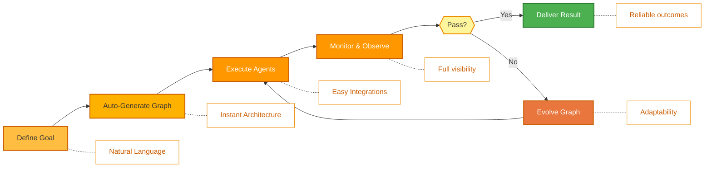
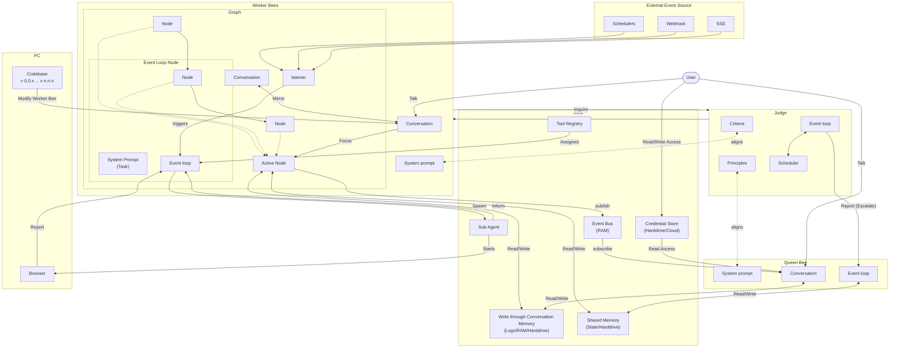

<p align="center">
  
</p>

<p align="center">
  <a href="../../README.md">English</a> |
  <a href="zh-CN.md">简体中文</a> |
  <a href="es.md">Español</a> |
  <a href="hi.md">हिन्दी</a> |
  <a href="pt.md">Português</a> |
  <a href="ja.md">日本語</a> |
  <a href="ru.md">Русский</a> |
  <a href="ko.md">한국어</a>
</p>

<p align="center">
  <a href="https://github.com/aden-hive/hive/blob/main/LICENSE"></a>
  <a href="https://www.ycombinator.com/companies/aden"></a>
  <a href="https://discord.com/invite/MXE49hrKDk"></a>
  <a href="https://x.com/aden_hq"></a>
  <a href="https://www.linkedin.com/company/teamaden/"></a>
  
</p>

<p align="center">
  
  
  
  
  
</p>
<p align="center">
  
  
  
</p>

## Descripcion General

Construye agentes de IA autonomos, confiables y auto-mejorables sin codificar flujos de trabajo. Define tu objetivo a traves de una conversacion con un agente de codificacion, y el framework genera un grafo de nodos con codigo de conexion creado dinamicamente. Cuando algo falla, el framework captura los datos del error, evoluciona el agente a traves del agente de codificacion y lo vuelve a desplegar. Los nodos de intervencion humana integrados, la gestion de credenciales y el monitoreo en tiempo real te dan control sin sacrificar la adaptabilidad.

Visita [adenhq.com](https://adenhq.com) para documentacion completa, ejemplos y guias.

[](https://www.youtube.com/watch?v=XDOG9fOaLjU)

## Para Quien es Hive?

Hive esta disenado para desarrolladores y equipos que quieren construir **agentes de IA de grado productivo** sin cablear manualmente flujos de trabajo complejos.

Hive es una buena opcion si:

- Quieres agentes de IA que **ejecuten procesos de negocio reales**, no demos
- Prefieres el **desarrollo orientado a objetivos** sobre flujos de trabajo codificados
- Necesitas **agentes auto-reparables y adaptativos** que mejoren con el tiempo
- Requieres **control humano en el bucle**, observabilidad y limites de costo
- Planeas ejecutar agentes en **entornos de produccion**

Hive puede no ser la mejor opcion si solo estas experimentando con cadenas de agentes simples o scripts puntuales.

## Cuando Deberias Usar Hive?

Usa Hive cuando necesites:

- Agentes autonomos de larga duracion
- Guardarrailes, procesos y controles solidos
- Mejora continua basada en fallos
- Coordinacion multi-agente
- Un framework que evolucione con tus objetivos

## Enlaces Rapidos

- **[Documentacion](https://docs.adenhq.com/)** - Guias completas y referencia de API
- **[Guia de Auto-Hospedaje](https://docs.adenhq.com/getting-started/quickstart)** - Despliega Hive en tu infraestructura
- **[Registro de Cambios](https://github.com/aden-hive/hive/releases)** - Ultimas actualizaciones y versiones
- **[Hoja de Ruta](../roadmap.md)** - Funciones y planes proximos
- **[Reportar Problemas](https://github.com/adenhq/hive/issues)** - Reportes de bugs y solicitudes de funciones
- **[Contribuir](../../CONTRIBUTING.md)** - Como contribuir y enviar PRs

## Inicio Rapido

### Prerrequisitos

- Python 3.11+ para desarrollo de agentes
- Claude Code, Codex CLI o Cursor para utilizar habilidades de agentes

> **Nota para Usuarios de Windows:** Se recomienda encarecidamente usar **WSL (Windows Subsystem for Linux)** o **Git Bash** para ejecutar este framework. Algunos scripts de automatizacion principales pueden no ejecutarse correctamente en el Command Prompt o PowerShell estandar.

### Instalacion

> **Nota**
> Hive usa un esquema de workspace `uv` y no se instala con `pip install`.
> Ejecutar `pip install -e .` desde la raiz del repositorio creara un paquete placeholder y Hive no funcionara correctamente.
> Por favor usa el script de inicio rapido a continuacion para configurar el entorno.

```bash
# Clone the repository
git clone https://github.com/aden-hive/hive.git
cd hive


# Run quickstart setup
./quickstart.sh
```

Esto configura:

- **framework** - Runtime principal del agente y ejecutor de grafos (en `core/.venv`)
- **aden_tools** - Herramientas MCP para capacidades de agentes (en `tools/.venv`)
- **credential store** - Almacenamiento encriptado de claves API (`~/.hive/credentials`)
- **LLM provider** - Configuracion interactiva del modelo predeterminado
- Todas las dependencias de Python requeridas con `uv`

- Al final, iniciara la interfaz abierta de Hive en tu navegador


### Construye Tu Primer Agente

Escribe el agente que quieres construir en el cuadro de entrada de la pantalla principal


### Usa Agentes de Plantilla

Haz clic en "Try a sample agent" y revisa las plantillas. Puedes ejecutar una plantilla directamente o elegir construir tu version sobre la plantilla existente.

## Caracteristicas

- **Browser-Use** - Controla el navegador de tu computadora para lograr tareas dificiles
- **Ejecucion en Paralelo** - Ejecuta el grafo generado en paralelo. De esta manera puedes tener multiples agentes completando las tareas por ti
- **[Generacion Orientada a Objetivos](../key_concepts/goals_outcome.md)** - Define objetivos en lenguaje natural; el agente de codificacion genera el grafo de agentes y el codigo de conexion para lograrlos
- **[Adaptabilidad](../key_concepts/evolution.md)** - El framework captura fallos, calibra segun los objetivos y evoluciona el grafo de agentes
- **[Conexiones de Nodos Dinamicas](../key_concepts/graph.md)** - Sin aristas predefinidas; el codigo de conexion es generado por cualquier LLM capaz basado en tus objetivos
- **Nodos Envueltos en SDK** - Cada nodo obtiene memoria compartida, memoria RLM local, monitoreo, herramientas y acceso LLM de serie
- **[Humano en el Bucle](../key_concepts/graph.md#human-in-the-loop)** - Nodos de intervencion que pausan la ejecucion para entrada humana con tiempos de espera y escalacion configurables
- **Observabilidad en Tiempo Real** - Streaming WebSocket para monitoreo en vivo de ejecucion de agentes, decisiones y comunicacion entre nodos
- **Listo para Produccion** - Auto-hospedable, construido para escala y confiabilidad

## Integracion

<a href="https://github.com/aden-hive/hive/tree/main/tools/src/aden_tools/tools"></a>
Hive esta construido para ser agnostico de modelo y agnostico de sistema.

- **Flexibilidad de LLM** - Hive Framework esta disenado para soportar varios tipos de LLMs, incluyendo modelos alojados y locales a traves de proveedores compatibles con LiteLLM.
- **Conectividad con sistemas de negocio** - Hive Framework esta disenado para conectarse a todo tipo de sistemas de negocio como herramientas, tales como CRM, soporte, mensajeria, datos, archivos y APIs internas via MCP.

## Por Que Aden

Hive se enfoca en generar agentes que ejecutan procesos de negocio reales en lugar de agentes genericos. En lugar de requerir que diseñes manualmente flujos de trabajo, definas interacciones de agentes y manejes fallos de forma reactiva, Hive invierte el paradigma: **describes resultados, y el sistema se construye solo** — ofreciendo una experiencia adaptativa y orientada a resultados con un conjunto de herramientas e integraciones facil de usar.



### La Ventaja de Hive

| Frameworks Tradicionales                  | Hive                                         |
| ----------------------------------------- | -------------------------------------------- |
| Codificar flujos de trabajo de agentes    | Describir objetivos en lenguaje natural      |
| Definicion manual de grafos               | Grafos de agentes auto-generados             |
| Manejo reactivo de errores                | Evaluacion de resultados y adaptabilidad     |
| Configuraciones de herramientas estaticas | Nodos dinamicos envueltos en SDK             |
| Configuracion de monitoreo separada       | Observabilidad en tiempo real integrada      |
| Gestion de presupuesto DIY                | Controles de costos y degradacion integrados |

### Como Funciona

1. **[Define Tu Objetivo](../key_concepts/goals_outcome.md)** -> Describe lo que quieres lograr en lenguaje simple
2. **El Agente de Codificacion Genera** -> Crea el [grafo de agentes](../key_concepts/graph.md), codigo de conexion y casos de prueba
3. **[Los Trabajadores Ejecutan](../key_concepts/worker_agent.md)** -> Los nodos envueltos en SDK se ejecutan con observabilidad completa y acceso a herramientas
4. **El Plano de Control Monitorea** -> Metricas en tiempo real, aplicacion de presupuesto, gestion de politicas
5. **[Adaptabilidad](../key_concepts/evolution.md)** -> En caso de fallo, el sistema evoluciona el grafo y lo vuelve a desplegar automaticamente

## Ejecutar Agentes

Ahora puedes ejecutar un agente seleccionando el agente (ya sea un agente existente o un agente de ejemplo). Puedes hacer clic en el boton Run en la parte superior izquierda, o hablar con el agente queen y este puede ejecutar el agente por ti.

## Documentacion

- **[Guia del Desarrollador](../developer-guide.md)** - Guia completa para desarrolladores
- [Primeros Pasos](../getting-started.md) - Instrucciones de configuracion rapida
- [Guia de Configuracion](../configuration.md) - Todas las opciones de configuracion
- [Vision General de Arquitectura](../architecture/README.md) - Diseno y estructura del sistema

## Hoja de Ruta

El Framework de Agentes Aden Hive tiene como objetivo ayudar a los desarrolladores a construir agentes auto-adaptativos orientados a resultados. Consulta [roadmap.md](../roadmap.md) para mas detalles.



## Contribuir
Damos la bienvenida a las contribuciones de la comunidad! Estamos especialmente buscando ayuda para construir herramientas, integraciones y agentes de ejemplo para el framework ([consulta #2805](https://github.com/aden-hive/hive/issues/2805)). Si te interesa extender su funcionalidad, este es el lugar perfecto para empezar. Por favor consulta [CONTRIBUTING.md](../../CONTRIBUTING.md) para las directrices.

**Importante:** Por favor, solicita que se te asigne un issue antes de enviar un PR. Comenta en el issue para reclamarlo y un mantenedor te lo asignara. Los issues con pasos reproducibles y propuestas son priorizados. Esto ayuda a evitar trabajo duplicado.

1. Encuentra o crea un issue y solicita asignacion
2. Haz fork del repositorio
3. Crea tu rama de funcionalidad (`git checkout -b feature/amazing-feature`)
4. Haz commit de tus cambios (`git commit -m 'Add amazing feature'`)
5. Haz push a la rama (`git push origin feature/amazing-feature`)
6. Abre un Pull Request

## Comunidad y Soporte

Usamos [Discord](https://discord.com/invite/MXE49hrKDk) para soporte, solicitudes de funciones y discusiones de la comunidad.

- Discord - [Unete a nuestra comunidad](https://discord.com/invite/MXE49hrKDk)
- Twitter/X - [@adenhq](https://x.com/aden_hq)
- LinkedIn - [Pagina de la Empresa](https://www.linkedin.com/company/teamaden/)

## Unete a Nuestro Equipo

**Estamos contratando!** Unete a nosotros en roles de ingenieria, investigacion y comercializacion.

[Ver Posiciones Abiertas](https://jobs.adenhq.com/a8cec478-cdbc-473c-bbd4-f4b7027ec193/applicant)

## Seguridad

Para preocupaciones de seguridad, por favor consulta [SECURITY.md](../../SECURITY.md).

## Licencia

Este proyecto esta licenciado bajo la Licencia Apache 2.0 - consulta el archivo [LICENSE](../../LICENSE) para mas detalles.

## Preguntas Frecuentes (FAQ)

**P: Que proveedores de LLM soporta Hive?**

Hive soporta mas de 100 proveedores de LLM a traves de la integracion de LiteLLM, incluyendo OpenAI (GPT-4, GPT-4o), Anthropic (modelos Claude), Google Gemini, DeepSeek, Mistral, Groq y muchos mas. Simplemente configura la variable de entorno de la clave API apropiada y especifica el nombre del modelo. Recomendamos usar Claude, GLM y Gemini ya que tienen el mejor rendimiento.

**P: Puedo usar Hive con modelos de IA locales como Ollama?**

Si! Hive soporta modelos locales a traves de LiteLLM. Simplemente usa el formato de nombre de modelo `ollama/model-name` (por ejemplo, `ollama/llama3`, `ollama/mistral`) y asegurate de que Ollama este ejecutandose localmente.

**P: Que hace que Hive sea diferente de otros frameworks de agentes?**

Hive genera todo tu sistema de agentes a partir de objetivos en lenguaje natural usando un agente de codificacion -- no codificas flujos de trabajo ni defines grafos manualmente. Cuando los agentes fallan, el framework captura automaticamente los datos del fallo, [evoluciona el grafo de agentes](../key_concepts/evolution.md) y lo vuelve a desplegar. Este ciclo de auto-mejora es unico de Aden.

**P: Hive es de codigo abierto?**

Si, Hive es completamente de codigo abierto bajo la Licencia Apache 2.0. Fomentamos activamente las contribuciones y colaboracion de la comunidad.

**P: Puede Hive manejar casos de uso complejos a escala de produccion?**

Si. Hive esta explicitamente disenado para entornos de produccion con caracteristicas como recuperacion automatica de fallos, observabilidad en tiempo real, controles de costos y soporte de escalado horizontal. El framework maneja tanto automatizaciones simples como flujos de trabajo multi-agente complejos.

**P: Hive soporta flujos de trabajo con humano en el bucle?**

Si, Hive soporta completamente flujos de trabajo con [humano en el bucle](../key_concepts/graph.md#human-in-the-loop) a traves de nodos de intervencion que pausan la ejecucion para entrada humana. Estos incluyen tiempos de espera configurables y politicas de escalacion, permitiendo colaboracion fluida entre expertos humanos y agentes de IA.

**P: Que lenguajes de programacion soporta Hive?**

El framework Hive esta construido en Python. Un SDK de JavaScript/TypeScript esta en la hoja de ruta.

**P: Pueden los agentes de Hive interactuar con herramientas y APIs externas?**

Si. Los nodos envueltos en SDK de Aden proporcionan acceso integrado a herramientas, y el framework soporta ecosistemas de herramientas flexibles. Los agentes pueden integrarse con APIs externas, bases de datos y servicios a traves de la arquitectura de nodos.

**P: Como funciona el control de costos en Hive?**

Hive proporciona controles de presupuesto granulares incluyendo limites de gasto, limitadores y politicas de degradacion automatica de modelos. Puedes establecer presupuestos a nivel de equipo, agente o flujo de trabajo, con seguimiento de costos en tiempo real y alertas.

**P: Donde puedo encontrar ejemplos y documentacion?**

Visita [docs.adenhq.com](https://docs.adenhq.com/) para guias completas, referencia de API y tutoriales para empezar. El repositorio tambien incluye documentacion en la carpeta `docs/` y una [guia del desarrollador](../developer-guide.md) completa.

**P: Como puedo contribuir a Aden?**

Las contribuciones son bienvenidas! Haz fork del repositorio, crea tu rama de funcionalidad, implementa tus cambios y envia un pull request. Consulta [CONTRIBUTING.md](../../CONTRIBUTING.md) para directrices detalladas.

---

<p align="center">
  Hecho con 🔥 Pasion en San Francisco
</p>
