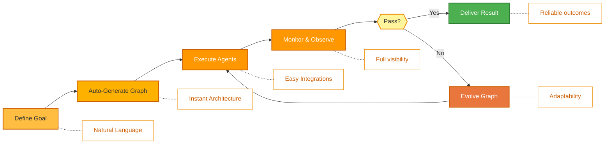
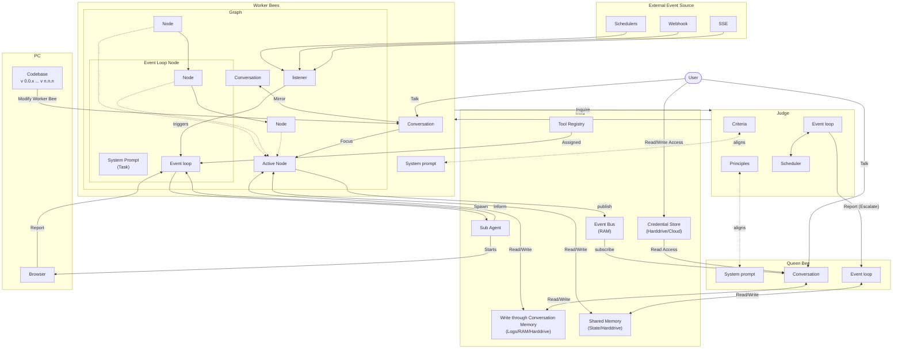

<p align="center">
  
</p>

<p align="center">
  <a href="../../README.md">English</a> |
  <a href="zh-CN.md">简体中文</a> |
  <a href="es.md">Español</a> |
  <a href="hi.md">हिन्दी</a> |
  <a href="pt.md">Português</a> |
  <a href="ja.md">日本語</a> |
  <a href="ru.md">Русский</a> |
  <a href="ko.md">한국어</a>
</p>

<p align="center">
  <a href="https://github.com/aden-hive/hive/blob/main/LICENSE"></a>
  <a href="https://www.ycombinator.com/companies/aden"></a>
  <a href="https://discord.com/invite/MXE49hrKDk"></a>
  <a href="https://x.com/aden_hq"></a>
  <a href="https://www.linkedin.com/company/teamaden/"></a>
  
</p>

<p align="center">
  
  
  
  
  
</p>
<p align="center">
  
  
  
</p>

## अवलोकन

वर्कफ़्लो को हार्डकोड किए बिना स्वायत्त, भरोसेमंद और स्वयं-सुधार करने वाले AI एजेंट बनाएँ। कोडिंग एजेंट के साथ बातचीत के माध्यम से अपना लक्ष्य परिभाषित करें, और फ़्रेमवर्क डायनेमिक रूप से बनाए गए कनेक्शन कोड के साथ एक नोड ग्राफ़ उत्पन्न करता है। जब कुछ विफल होता है, फ़्रेमवर्क उस त्रुटि का डेटा कैप्चर करता है, कोडिंग एजेंट के माध्यम से एजेंट को विकसित करता है और उसे दोबारा डिप्लॉय करता है। एकीकृत human-in-the-loop नोड्स, क्रेडेंशियल प्रबंधन और रीयल-टाइम मॉनिटरिंग आपको अनुकूलनशीलता खोए बिना पूरा नियंत्रण देते हैं।

पूर्ण दस्तावेज़ीकरण, उदाहरणों और मार्गदर्शिकाओं के लिए [adenhq.com](https://adenhq.com) पर जाएँ।

[](https://www.youtube.com/watch?v=XDOG9fOaLjU)

## Hive किसके लिए है?

Hive उन डेवलपर्स और टीमों के लिए डिज़ाइन किया गया है जो जटिल वर्कफ़्लो को मैन्युअली वायर किए बिना **प्रोडक्शन-ग्रेड AI एजेंट** बनाना चाहते हैं।

Hive आपके लिए उपयुक्त है यदि आप:

- ऐसे AI एजेंट चाहते हैं जो **वास्तविक व्यावसायिक प्रक्रियाओं को निष्पादित करें**, केवल डेमो नहीं
- **हार्डकोडेड वर्कफ़्लो** के बजाय **लक्ष्य-आधारित विकास** पसंद करते हैं
- ऐसे **स्वयं-सुधार करने वाले और अनुकूली एजेंट** चाहते हैं जो समय के साथ बेहतर हों
- **मानव-इन-द-लूप नियंत्रण**, ऑब्ज़र्वेबिलिटी और लागत सीमाएँ आवश्यक हैं
- एजेंट्स को **प्रोडक्शन वातावरण** में चलाने की योजना है

Hive उपयुक्त नहीं हो सकता यदि आप केवल साधारण एजेंट चेन्स या एकबारगी स्क्रिप्ट्स के साथ प्रयोग कर रहे हैं।

## Hive का उपयोग कब करें?

Hive का उपयोग करें जब आपको आवश्यकता हो:

- लंबे समय तक चलने वाले, स्वायत्त एजेंट
- मजबूत गार्डरेल्स, प्रक्रिया और नियंत्रण
- विफलताओं पर आधारित निरंतर सुधार
- मल्टी-एजेंट समन्वय
- एक ऐसा फ़्रेमवर्क जो आपके लक्ष्यों के साथ विकसित हो

## त्वरित लिंक

- **[डाक्यूमेंटेशन](https://docs.adenhq.com/)** - पूर्ण गाइड्स और API संदर्भ
- **[सेल्फ-होस्टिंग गाइड](https://docs.adenhq.com/getting-started/quickstart)** - Hive को अपने इंफ़्रास्ट्रक्चर पर डिप्लॉय करें
- **[चेंजलॉग](https://github.com/aden-hive/hive/releases)** - नवीनतम अपडेट और रिलीज़
- **[रोडमैप](../roadmap.md)** - आगामी सुविधाएँ और योजनाएँ
- **[इशू रिपोर्ट करें](https://github.com/adenhq/hive/issues)** - बग रिपोर्ट और फ़ीचर अनुरोध
- **[योगदान करें](../../CONTRIBUTING.md)** - योगदान करने और PR सबमिट करने का तरीका

## त्वरित शुरुआत

### आवश्यकताएँ

- एजेंट विकास के लिए Python 3.11+
- एजेंट स्किल्स का उपयोग करने के लिए Claude Code, Codex CLI, या Cursor

> **विंडोज उपयोगकर्ताओं के लिए नोट:** इस फ़्रेमवर्क को चलाने के लिए **WSL (Windows Subsystem for Linux)** या **Git Bash** का उपयोग करने की दृढ़ता से अनुशंसा की जाती है। कुछ मुख्य ऑटोमेशन स्क्रिप्ट्स मानक Command Prompt या PowerShell में सही ढंग से निष्पादित नहीं हो सकती हैं।

### इंस्टॉलेशन

> **नोट**
> Hive एक `uv` वर्कस्पेस लेआउट का उपयोग करता है और `pip install` से इंस्टॉल नहीं होता।
> रिपॉज़िटरी रूट से `pip install -e .` चलाने से एक प्लेसहोल्डर पैकेज बनेगा और Hive सही ढंग से काम नहीं करेगा।
> कृपया वातावरण सेट अप करने के लिए नीचे दी गई क्विकस्टार्ट स्क्रिप्ट का उपयोग करें।

```bash
# Clone the repository
git clone https://github.com/aden-hive/hive.git
cd hive


# Run quickstart setup
./quickstart.sh
```

यह सेट अप करता है:

- **framework** - मुख्य एजेंट रनटाइम और ग्राफ़ एक्ज़ीक्यूटर (`core/.venv` में)
- **aden_tools** - एजेंट क्षमताओं के लिए MCP टूल्स (`tools/.venv` में)
- **credential store** - एन्क्रिप्टेड API कुंजी भंडारण (`~/.hive/credentials`)
- **LLM provider** - इंटरैक्टिव डिफ़ॉल्ट मॉडल कॉन्फ़िगरेशन
- `uv` के साथ सभी आवश्यक Python डिपेंडेंसीज़

- अंत में, यह आपके ब्राउज़र में open hive इंटरफ़ेस शुरू करेगा


### अपना पहला एजेंट बनाएँ

होम इनपुट बॉक्स में वह एजेंट टाइप करें जिसे आप बनाना चाहते हैं


### टेम्पलेट एजेंट्स का उपयोग करें

"Try a sample agent" पर क्लिक करें और टेम्पलेट्स देखें। आप किसी टेम्पलेट को सीधे चला सकते हैं या मौजूदा टेम्पलेट के ऊपर अपना संस्करण बनाने का विकल्प चुन सकते हैं।

## विशेषताएँ

- **Browser-Use** - कठिन कार्यों को पूरा करने के लिए अपने कंप्यूटर पर ब्राउज़र को नियंत्रित करें
- **समानांतर निष्पादन** - उत्पन्न ग्राफ़ को समानांतर में निष्पादित करें। इस तरह आपके लिए कई एजेंट एक साथ कार्य पूरा कर सकते हैं
- **[लक्ष्य-आधारित उत्पादन](../key_concepts/goals_outcome.md)** - प्राकृतिक भाषा में उद्देश्य परिभाषित करें; कोडिंग एजेंट उन्हें हासिल करने के लिए एजेंट ग्राफ़ और कनेक्शन कोड उत्पन्न करता है
- **[अनुकूलनशीलता](../key_concepts/evolution.md)** - फ़्रेमवर्क विफलताओं को कैप्चर करता है, उद्देश्यों के अनुसार कैलिब्रेट करता है, और एजेंट ग्राफ़ को विकसित करता है
- **[डायनेमिक नोड कनेक्शन](../key_concepts/graph.md)** - पूर्व-परिभाषित किनारों के बिना; आपके लक्ष्यों के आधार पर किसी भी सक्षम LLM द्वारा कनेक्शन कोड उत्पन्न किया जाता है
- **SDK-रैप्ड नोड्स** - प्रत्येक नोड को साझा मेमोरी, स्थानीय RLM मेमोरी, मॉनिटरिंग, टूल्स और LLM एक्सेस डिफ़ॉल्ट रूप से मिलता है
- **[मानव-इन-द-लूप](../key_concepts/graph.md#human-in-the-loop)** - मानव हस्तक्षेप नोड्स जो मानव इनपुट के लिए निष्पादन को रोकते हैं, कॉन्फ़िगर करने योग्य टाइमआउट और एस्केलेशन के साथ
- **रीयल-टाइम ऑब्ज़र्वेबिलिटी** - एजेंट निष्पादन, निर्णयों और नोड-से-नोड संचार की लाइव मॉनिटरिंग के लिए WebSocket स्ट्रीमिंग
- **प्रोडक्शन के लिए तैयार** - स्वयं-होस्ट करने योग्य, स्केल और विश्वसनीयता के लिए निर्मित

## इंटीग्रेशन

<a href="https://github.com/aden-hive/hive/tree/main/tools/src/aden_tools/tools"></a>
Hive मॉडल-एग्नॉस्टिक और सिस्टम-एग्नॉस्टिक बनाया गया है।

- **LLM लचीलापन** - Hive फ़्रेमवर्क विभिन्न प्रकार के LLMs को सपोर्ट करने के लिए डिज़ाइन किया गया है, जिसमें LiteLLM-संगत प्रदाताओं के माध्यम से होस्टेड और लोकल मॉडल शामिल हैं।
- **व्यावसायिक सिस्टम कनेक्टिविटी** - Hive फ़्रेमवर्क CRM, सपोर्ट, मैसेजिंग, डेटा, फ़ाइल और आंतरिक APIs जैसे सभी प्रकार के व्यावसायिक सिस्टम से MCP के माध्यम से टूल्स के रूप में कनेक्ट करने के लिए डिज़ाइन किया गया है।

## Aden क्यों

Hive जेनेरिक एजेंट्स के बजाय वास्तविक व्यावसायिक प्रक्रियाओं को चलाने वाले एजेंट उत्पन्न करने पर केंद्रित है। आपको मैन्युअली वर्कफ़्लो डिज़ाइन करने, एजेंट इंटरैक्शन्स परिभाषित करने और विफलताओं को प्रतिक्रियात्मक रूप से संभालने की आवश्यकता के बजाय, Hive इस पैरेडाइम को उलट देता है: **आप परिणामों का वर्णन करते हैं, और सिस्टम अपने-आप तैयार हो जाता है**—एक परिणाम-उन्मुख, अनुकूली अनुभव प्रदान करता है जिसमें उपयोग में आसान टूल्स और इंटीग्रेशन्स का सेट होता है।



### Hive की बढ़त

| पारंपरिक फ़्रेमवर्क्स                | Hive                                       |
| ------------------------------------ | ------------------------------------------ |
| एजेंट वर्कफ़्लो को हार्डकोड करना     | प्राकृतिक भाषा में लक्ष्यों का वर्णन       |
| ग्राफ़ की मैन्युअल परिभाषा           | स्वतः-उत्पन्न एजेंट ग्राफ़                 |
| त्रुटियों का प्रतिक्रियात्मक प्रबंधन | परिणाम-मूल्यांकन और अनुकूलनशीलता           |
| स्थिर टूल कॉन्फ़िगरेशन               | SDK-रैप्ड डायनेमिक नोड्स                   |
| अलग मॉनिटरिंग सेटअप                  | एकीकृत रीयल-टाइम ऑब्ज़र्वेबिलिटी           |
| DIY बजट प्रबंधन                      | एकीकृत लागत नियंत्रण और डिग्रेडेशन नीतियाँ |

### यह कैसे काम करता है

1. **[अपना लक्ष्य परिभाषित करें](../key_concepts/goals_outcome.md)** → सरल भाषा में बताएं कि आप क्या हासिल करना चाहते हैं
2. **कोडिंग एजेंट उत्पन्न करता है** → [एजेंट ग्राफ़](../key_concepts/graph.md), कनेक्शन कोड और टेस्ट केस तैयार करता है
3. **[वर्कर एजेंट्स निष्पादन करते हैं](../key_concepts/worker_agent.md)** → SDK-रैप्ड नोड्स पूर्ण ऑब्ज़र्वेबिलिटी और टूल्स तक पहुँच के साथ चलते हैं
4. **कंट्रोल प्लेन निगरानी करता है** → रीयल-टाइम मेट्रिक्स, बजट प्रवर्तन, नीति प्रबंधन
5. **[अनुकूलनशीलता](../key_concepts/evolution.md)** → विफलता की स्थिति में, सिस्टम ग्राफ़ को विकसित करता है और स्वचालित रूप से दोबारा डिप्लॉय करता है

## एजेंट चलाएँ

अब आप किसी एजेंट को चुनकर (मौजूदा एजेंट या उदाहरण एजेंट) चला सकते हैं। आप ऊपर बाईं ओर Run बटन पर क्लिक कर सकते हैं, या क्वीन एजेंट से बात कर सकते हैं और वह आपके लिए एजेंट चला सकती है।

## दस्तावेज़ीकरण

- **[डेवलपर गाइड](../developer-guide.md)** - डेवलपर्स के लिए पूर्ण मार्गदर्शिका
- [शुरुआत करें](../getting-started.md) - त्वरित सेटअप निर्देश
- [कॉन्फ़िगरेशन गाइड](../configuration.md) - सभी कॉन्फ़िगरेशन विकल्प
- [आर्किटेक्चर का अवलोकन](../architecture/README.md) - सिस्टम का डिज़ाइन और संरचना

## रोडमैप

Aden Hive एजेंट फ़्रेमवर्क का उद्देश्य डेवलपर्स को परिणाम-उन्मुख, स्वयं-अनुकूलित एजेंट बनाने में मदद करना है। विवरण के लिए [roadmap.md](../roadmap.md) देखें।



## योगदान करें
हम समुदाय से योगदान का स्वागत करते हैं! हम विशेष रूप से फ़्रेमवर्क के लिए टूल्स, इंटीग्रेशन्स और उदाहरण एजेंट बनाने में मदद की तलाश में हैं ([#2805 देखें](https://github.com/aden-hive/hive/issues/2805))। यदि आप इसकी कार्यक्षमता बढ़ाने में रुचि रखते हैं, तो यह शुरू करने के लिए सबसे अच्छी जगह है। कृपया दिशानिर्देशों के लिए [CONTRIBUTING.md](../../CONTRIBUTING.md) देखें।

**महत्वपूर्ण:** कृपया PR सबमिट करने से पहले किसी issue को अपने नाम असाइन करवाएँ। इसे क्लेम करने के लिए issue पर टिप्पणी करें, और कोई मेंटेनर आपको असाइन कर देगा। पुनरुत्पादन योग्य चरणों और प्रस्तावों वाले issues को प्राथमिकता दी जाती है। इससे डुप्लिकेट काम से बचाव होता है।

1. कोई issue खोजें या बनाएँ और असाइनमेंट प्राप्त करें
2. रिपॉज़िटरी को fork करें
3. अपनी फ़ीचर ब्रांच बनाएँ (`git checkout -b feature/amazing-feature`)
4. अपने बदलावों को commit करें (`git commit -m 'Add amazing feature'`)
5. ब्रांच को push करें (`git push origin feature/amazing-feature`)
6. एक Pull Request खोलें

## समुदाय और सहायता

हम सपोर्ट, फ़ीचर अनुरोधों और कम्युनिटी चर्चाओं के लिए [Discord](https://discord.com/invite/MXE49hrKDk) का उपयोग करते हैं।

- Discord - [हमारे समुदाय से जुड़ें](https://discord.com/invite/MXE49hrKDk)
- Twitter/X - [@adenhq](https://x.com/aden_hq)
- LinkedIn - [कंपनी पेज](https://www.linkedin.com/company/teamaden/)

## हमारी टीम से जुड़ें

**हम भर्ती कर रहे हैं!** इंजीनियरिंग, रिसर्च और गो-टू-मार्केट भूमिकाओं में हमारे साथ जुड़ें।

[खुली पदों को देखें](https://jobs.adenhq.com/a8cec478-cdbc-473c-bbd4-f4b7027ec193/applicant)

## सुरक्षा

सुरक्षा संबंधी चिंताओं के लिए, कृपया [SECURITY.md](../../SECURITY.md) देखें।

## लाइसेंस

यह प्रोजेक्ट Apache License 2.0 के अंतर्गत लाइसेंस्ड है - विवरण के लिए [LICENSE](../../LICENSE) फ़ाइल देखें।

## अक्सर पूछे जाने वाले प्रश्न (FAQ)

**प्रश्न: Hive कौन-कौन से LLM प्रदाताओं को सपोर्ट करता है?**

Hive LiteLLM इंटीग्रेशन के माध्यम से 100 से अधिक LLM प्रदाताओं को सपोर्ट करता है, जिसमें OpenAI (GPT-4, GPT-4o), Anthropic (Claude मॉडल), Google Gemini, DeepSeek, Mistral, Groq और कई अन्य शामिल हैं। बस संबंधित API कुंजी के लिए एनवायरनमेंट वेरिएबल सेट करें और मॉडल का नाम निर्दिष्ट करें। हम Claude, GLM और Gemini के उपयोग की सिफ़ारिश करते हैं क्योंकि इनका प्रदर्शन सबसे अच्छा है।

**प्रश्न: क्या मैं Hive का उपयोग Ollama जैसे लोकल AI मॉडलों के साथ कर सकता हूँ?**

हाँ! Hive LiteLLM के माध्यम से लोकल मॉडलों को सपोर्ट करता है। बस `ollama/model-name` फ़ॉर्मेट में मॉडल नाम का उपयोग करें (उदा., `ollama/llama3`, `ollama/mistral`) और सुनिश्चित करें कि Ollama स्थानीय रूप से चल रहा है।

**प्रश्न: Hive को अन्य एजेंट फ़्रेमवर्क्स से अलग क्या बनाता है?**

Hive आपके संपूर्ण एजेंट सिस्टम को प्राकृतिक भाषा में दिए गए लक्ष्यों से कोडिंग एजेंट का उपयोग करके उत्पन्न करता है—आपको वर्कफ़्लो को हार्डकोड करने या मैन्युअली ग्राफ़ परिभाषित करने की आवश्यकता नहीं। जब एजेंट विफल होते हैं, फ़्रेमवर्क स्वचालित रूप से विफलता डेटा कैप्चर करता है, [एजेंट ग्राफ़ को विकसित करता है](../key_concepts/evolution.md), और दोबारा डिप्लॉय करता है। यह स्व-सुधार चक्र Aden के लिए अद्वितीय है।

**प्रश्न: क्या Hive ओपन-सोर्स है?**

हाँ, Hive पूरी तरह से ओपन-सोर्स है और Apache License 2.0 के तहत उपलब्ध है। हम समुदाय के योगदान और सहयोग को सक्रिय रूप से प्रोत्साहित करते हैं।

**प्रश्न: क्या Hive जटिल, प्रोडक्शन-स्केल उपयोग मामलों को संभाल सकता है?**

हाँ। Hive स्पष्ट रूप से प्रोडक्शन वातावरण के लिए डिज़ाइन किया गया है, जिसमें स्वचालित विफलता रिकवरी, रीयल-टाइम ऑब्ज़र्वेबिलिटी, लागत नियंत्रण और क्षैतिज स्केलिंग सपोर्ट जैसी सुविधाएँ हैं। फ़्रेमवर्क सरल ऑटोमेशन और जटिल मल्टी-एजेंट वर्कफ़्लो दोनों को संभालता है।

**प्रश्न: क्या Hive ह्यूमन-इन-द-लूप वर्कफ़्लो को सपोर्ट करता है?**

हाँ, Hive [ह्यूमन-इन-द-लूप](../key_concepts/graph.md#human-in-the-loop) वर्कफ़्लो को पूरी तरह सपोर्ट करता है, इंटरवेंशन नोड्स के माध्यम से जो मानव इनपुट के लिए निष्पादन को रोकते हैं। इसमें कॉन्फ़िगर करने योग्य टाइमआउट और एस्केलेशन नीतियाँ शामिल हैं, जिससे मानव विशेषज्ञों और AI एजेंट्स के बीच सहज सहयोग संभव होता है।

**प्रश्न: Hive कौन सी प्रोग्रामिंग भाषाओं को सपोर्ट करता है?**

Hive फ़्रेमवर्क Python में बनाया गया है। JavaScript/TypeScript SDK रोडमैप पर है।

**प्रश्न: क्या Hive एजेंट बाहरी टूल्स और APIs के साथ इंटरैक्ट कर सकते हैं?**

हाँ। Aden के SDK-रैप्ड नोड्स बिल्ट-इन टूल एक्सेस प्रदान करते हैं, और फ़्रेमवर्क लचीले टूल इकोसिस्टम को सपोर्ट करता है। एजेंट नोड आर्किटेक्चर के माध्यम से बाहरी APIs, डेटाबेस और सेवाओं के साथ इंटीग्रेट हो सकते हैं।

**प्रश्न: Hive में लागत नियंत्रण कैसे काम करता है?**

Hive विस्तृत बजट नियंत्रण प्रदान करता है जिसमें खर्च की सीमाएँ, थ्रॉटल्स और स्वचालित मॉडल डिग्रेडेशन नीतियाँ शामिल हैं। आप टीम, एजेंट या वर्कफ़्लो स्तर पर बजट सेट कर सकते हैं, रीयल-टाइम लागत ट्रैकिंग और अलर्ट के साथ।

**प्रश्न: मुझे उदाहरण और दस्तावेज़ीकरण कहाँ मिलेंगे?**

पूर्ण गाइड्स, API संदर्भ और शुरुआत करने के ट्यूटोरियल्स के लिए [docs.adenhq.com](https://docs.adenhq.com/) पर जाएँ। रिपॉज़िटरी में `docs/` फ़ोल्डर में दस्तावेज़ीकरण और एक व्यापक [डेवलपर गाइड](../developer-guide.md) भी शामिल है।

**प्रश्न: मैं Aden में योगदान कैसे कर सकता हूँ?**

योगदान का स्वागत है! रिपॉज़िटरी को fork करें, अपनी फ़ीचर ब्रांच बनाएँ, अपने बदलाव लागू करें, और एक pull request सबमिट करें। विस्तृत दिशानिर्देशों के लिए [CONTRIBUTING.md](../../CONTRIBUTING.md) देखें।

---

<p align="center">
  सैन फ्रांसिस्को में 🔥 जुनून के साथ बनाया गया
</p>
