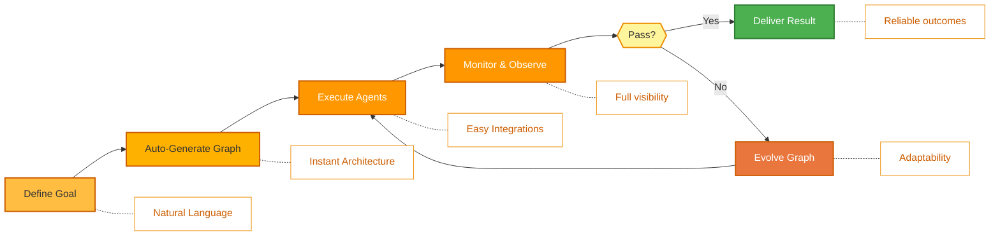
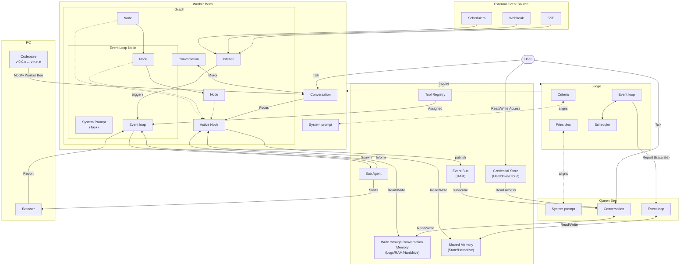

<p align="center">
  
</p>

<p align="center">
  <a href="../../README.md">English</a> |
  <a href="zh-CN.md">简体中文</a> |
  <a href="es.md">Español</a> |
  <a href="hi.md">हिन्दी</a> |
  <a href="pt.md">Português</a> |
  <a href="ja.md">日本語</a> |
  <a href="ru.md">Русский</a> |
  <a href="ko.md">한국어</a>
</p>

<p align="center">
  <a href="https://github.com/aden-hive/hive/blob/main/LICENSE"></a>
  <a href="https://www.ycombinator.com/companies/aden"></a>
  <a href="https://discord.com/invite/MXE49hrKDk"></a>
  <a href="https://x.com/aden_hq"></a>
  <a href="https://www.linkedin.com/company/teamaden/"></a>
  
</p>

<p align="center">
  
  
  
  
  
</p>
<p align="center">
  
  
  
</p>

## 概要

ワークフローをハードコーディングせずに、自律的で信頼性の高い自己改善型 AI エージェントを構築できます。コーディングエージェントとの会話を通じて目標を定義すると、フレームワークが動的に作成された接続コードを持つノードグラフを生成します。問題が発生すると、フレームワークは障害データをキャプチャし、コーディングエージェントを通じてエージェントを進化させ、再デプロイします。組み込みのヒューマンインザループノード、認証情報管理、リアルタイムモニタリングにより、適応性を損なうことなく制御を維持できます。

完全なドキュメント、例、ガイドについては [adenhq.com](https://adenhq.com) をご覧ください。

[](https://www.youtube.com/watch?v=XDOG9fOaLjU)

## Hive は誰のためのものか？

Hive は、複雑なワークフローを手動で配線することなく**本番グレードの AI エージェント**を構築したい開発者やチーム向けに設計されています。

Hive が適している場合：

- デモではなく、**実際のビジネスプロセスを実行する** AI エージェントが必要
- ハードコードされたワークフローよりも**目標駆動開発**を好む
- 時間とともに改善される**自己修復・適応型エージェント**が必要
- **ヒューマンインザループ制御**、可観測性、コスト制限が必要
- **本番環境**でエージェントを実行する予定がある

シンプルなエージェントチェーンや単発スクリプトの実験のみを行う場合、Hive は最適ではないかもしれません。

## いつ Hive を使うべきか？

Hive は以下が必要な場合に使用してください：

- 長時間実行される自律型エージェント
- 強力なガードレール、プロセス、制御
- 障害に基づく継続的な改善
- マルチエージェント連携
- 目標とともに進化するフレームワーク

## クイックリンク

- **[ドキュメント](https://docs.adenhq.com/)** - 完全なガイドと API リファレンス
- **[セルフホスティングガイド](https://docs.adenhq.com/getting-started/quickstart)** - インフラストラクチャへの Hive デプロイ
- **[変更履歴](https://github.com/aden-hive/hive/releases)** - 最新の更新とリリース
- **[ロードマップ](../roadmap.md)** - 今後の機能と計画
- **[問題を報告](https://github.com/adenhq/hive/issues)** - バグレポートと機能リクエスト
- **[貢献](../../CONTRIBUTING.md)** - 貢献方法と PR の提出方法

## クイックスタート

### 前提条件

- Python 3.11+ - エージェント開発用
- Claude Code、Codex CLI、または Cursor - エージェントスキルの活用用

> **Windows ユーザーへの注意：** このフレームワークを実行するには、**WSL（Windows Subsystem for Linux）**または **Git Bash** の使用を強く推奨します。一部のコア自動化スクリプトは、標準のコマンドプロンプトや PowerShell では正しく実行されない場合があります。

### インストール

> **注意**
> Hive は `uv` ワークスペースレイアウトを使用しており、`pip install` ではインストールされません。
> リポジトリのルートから `pip install -e .` を実行すると、プレースホルダーパッケージが作成され、Hive は正しく動作しません。
> 環境をセットアップするには、以下のクイックスタートスクリプトをご使用ください。

```bash
# リポジトリをクローン
git clone https://github.com/aden-hive/hive.git
cd hive


# クイックスタートセットアップを実行
./quickstart.sh
```

これにより以下がセットアップされます：

- **framework** - コアエージェントランタイムとグラフエグゼキュータ（`core/.venv` 内）
- **aden_tools** - エージェント機能のための MCP ツール（`tools/.venv` 内）
- **credential store** - 暗号化された API キーストレージ（`~/.hive/credentials`）
- **LLM provider** - インタラクティブなデフォルトモデル設定
- `uv` による必要な Python 依存関係すべて

- 最後に、ブラウザでオープン Hive インターフェースが起動します


### 最初のエージェントを構築

ホームの入力ボックスに構築したいエージェントを入力してください


### テンプレートエージェントを使用

「Try a sample agent」をクリックしてテンプレートを確認してください。テンプレートを直接実行することも、既存のテンプレートをベースに独自のバージョンを構築することもできます。

## 機能

- **ブラウザ操作** - コンピュータ上のブラウザを制御して困難なタスクを達成
- **並列実行** - 生成されたグラフを並列で実行。複数のエージェントが同時にジョブを完了
- **[目標駆動生成](../key_concepts/goals_outcome.md)** - 自然言語で目標を定義；コーディングエージェントがそれを達成するためのエージェントグラフと接続コードを生成
- **[適応性](../key_concepts/evolution.md)** - フレームワークが障害をキャプチャし、目標に応じて調整し、エージェントグラフを進化
- **[動的ノード接続](../key_concepts/graph.md)** - 事前定義されたエッジなし；接続コードは目標に基づいて任意の対応 LLM によって生成
- **SDK ラップノード** - すべてのノードが共有メモリ、ローカル RLM メモリ、モニタリング、ツール、LLM アクセスを標準装備
- **[ヒューマンインザループ](../key_concepts/graph.md#human-in-the-loop)** - 設定可能なタイムアウトとエスカレーションを備えた、人間の入力のために実行を一時停止する介入ノード
- **リアルタイム可観測性** - エージェント実行、決定、ノード間通信のライブモニタリングのための WebSocket ストリーミング
- **本番環境対応** - セルフホスト可能、スケールと信頼性のために構築

## 統合

<a href="https://github.com/aden-hive/hive/tree/main/tools/src/aden_tools/tools"></a>
Hive はモデル非依存およびシステム非依存に設計されています。

- **LLM の柔軟性** - Hive フレームワークは、LiteLLM 互換プロバイダーを通じて、ホスト型およびローカルモデルを含む様々なタイプの LLM をサポートするよう設計されています。
- **ビジネスシステム接続性** - Hive フレームワークは、CRM、サポート、メッセージング、データ、ファイル、内部 API など、MCP を介してあらゆる種類のビジネスシステムにツールとして接続するよう設計されています。

## なぜ Aden か

Hive は汎用的なエージェントではなく、実際のビジネスプロセスを実行するエージェントの生成に焦点を当てています。ワークフローを手動で設計し、エージェントの相互作用を定義し、障害を事後的に処理することを要求する代わりに、Hive はパラダイムを逆転させます：**結果を記述すれば、システムが自ら構築します**—結果駆動型で適応性のある体験を、使いやすいツールと統合のセットとともに提供します。



### Hive の優位性

| 従来のフレームワーク                   | Hive                                   |
| -------------------------------------- | -------------------------------------- |
| エージェントワークフローをハードコード | 自然言語で目標を記述                   |
| 手動でグラフを定義                     | 自動生成されるエージェントグラフ       |
| 事後的なエラー処理                     | 結果評価と適応性                       |
| 静的なツール設定                       | 動的な SDK ラップノード                |
| 別途モニタリング設定                   | 組み込みのリアルタイム可観測性         |
| DIY 予算管理                           | 統合されたコスト制御と劣化             |

### 仕組み

1. **[目標を定義](../key_concepts/goals_outcome.md)** → 達成したいことを平易な言葉で記述
2. **コーディングエージェントが生成** → [エージェントグラフ](../key_concepts/graph.md)、接続コード、テストケースを作成
3. **[ワーカーが実行](../key_concepts/worker_agent.md)** → SDK ラップノードが完全な可観測性とツールアクセスで実行
4. **コントロールプレーンが監視** → リアルタイムメトリクス、予算執行、ポリシー管理
5. **[適応性](../key_concepts/evolution.md)** → 障害時、システムがグラフを進化させ自動的に再デプロイ

## エージェントの実行

エージェントを選択して実行できます（既存のエージェントまたはサンプルエージェント）。左上の Run ボタンをクリックするか、クイーンエージェントに話しかけてエージェントを実行してもらうことができます。

## ドキュメント

- **[開発者ガイド](../developer-guide.md)** - 開発者向け総合ガイド
- [はじめに](../getting-started.md) - クイックセットアップ手順
- [設定ガイド](../configuration.md) - すべての設定オプション
- [アーキテクチャ概要](../architecture/README.md) - システム設計と構造

## ロードマップ

Aden Hive エージェントフレームワークは、開発者が結果志向で自己適応するエージェントを構築できるよう支援することを目指しています。詳細は [roadmap.md](../roadmap.md) をご覧ください。



## 貢献

コミュニティからの貢献を歓迎します！特にフレームワークのツール、統合、サンプルエージェントの構築にご協力いただける方を募集しています（[#2805 を確認](https://github.com/aden-hive/hive/issues/2805)）。機能拡張に興味がある方にとって、ここは最適な出発点です。ガイドラインについては [CONTRIBUTING.md](../../CONTRIBUTING.md) をご覧ください。

**重要：** PR を提出する前に、まず Issue にアサインされてください。Issue にコメントして担当を申請すると、メンテナーがアサインします。再現手順と提案を含む Issue が優先されます。これにより重複作業を防ぐことができます。

1. Issue を見つけるか作成し、アサインを受ける
2. リポジトリをフォーク
3. 機能ブランチを作成（`git checkout -b feature/amazing-feature`）
4. 変更をコミット（`git commit -m 'Add amazing feature'`）
5. ブランチにプッシュ（`git push origin feature/amazing-feature`）
6. プルリクエストを開く

## コミュニティとサポート

サポート、機能リクエスト、コミュニティディスカッションには [Discord](https://discord.com/invite/MXE49hrKDk) を使用しています。

- Discord - [コミュニティに参加](https://discord.com/invite/MXE49hrKDk)
- Twitter/X - [@adenhq](https://x.com/aden_hq)
- LinkedIn - [会社ページ](https://www.linkedin.com/company/teamaden/)

## チームに参加

**採用中です！** エンジニアリング、リサーチ、マーケティングの役職で私たちに参加してください。

[オープンポジションを見る](https://jobs.adenhq.com/a8cec478-cdbc-473c-bbd4-f4b7027ec193/applicant)

## セキュリティ

セキュリティに関する懸念については、[SECURITY.md](../../SECURITY.md) をご覧ください。

## ライセンス

このプロジェクトは Apache License 2.0 の下でライセンスされています - 詳細は [LICENSE](../../LICENSE) ファイルをご覧ください。

## よくある質問 (FAQ)

**Q: Hive はどの LLM プロバイダーをサポートしていますか？**

Hive は LiteLLM 統合を通じて 100 以上の LLM プロバイダーをサポートしており、OpenAI（GPT-4、GPT-4o）、Anthropic（Claude モデル）、Google Gemini、DeepSeek、Mistral、Groq などが含まれます。適切な API キー環境変数を設定し、モデル名を指定するだけです。Claude、GLM、Gemini が最高のパフォーマンスを発揮するため、推奨されます。

**Q: Ollama のようなローカル AI モデルで Hive を使用できますか？**

はい！Hive は LiteLLM を通じてローカルモデルをサポートしています。モデル名の形式 `ollama/model-name`（例：`ollama/llama3`、`ollama/mistral`）を使用し、Ollama がローカルで実行されていることを確認してください。

**Q: Hive は他のエージェントフレームワークと何が違いますか？**

Hive はコーディングエージェントを使用して自然言語の目標からエージェントシステム全体を生成します—ワークフローをハードコードしたり、グラフを手動で定義したりする必要はありません。エージェントが失敗すると、フレームワークは自動的に障害データをキャプチャし、[エージェントグラフを進化](../key_concepts/evolution.md)させ、再デプロイします。この自己改善ループは Aden 独自のものです。

**Q: Hive はオープンソースですか？**

はい、Hive は Apache License 2.0 の下で完全にオープンソースです。コミュニティの貢献とコラボレーションを積極的に奨励しています。

**Q: Hive は複雑な本番スケールのユースケースに対応できますか？**

はい。Hive は自動障害回復、リアルタイム可観測性、コスト制御、水平スケーリングサポートなどの機能を備え、本番環境向けに明確に設計されています。フレームワークはシンプルな自動化から複雑なマルチエージェントワークフローまで対応します。

**Q: Hive はヒューマンインザループワークフローをサポートしていますか？**

はい、Hive は人間の入力のために実行を一時停止する介入ノードを通じて、[ヒューマンインザループ](../key_concepts/graph.md#human-in-the-loop)ワークフローを完全にサポートしています。設定可能なタイムアウトとエスカレーションポリシーが含まれており、人間の専門家と AI エージェントのシームレスなコラボレーションを可能にします。

**Q: Hive はどのプログラミング言語をサポートしていますか？**

Hive フレームワークは Python で構築されています。JavaScript/TypeScript SDK はロードマップに含まれています。

**Q: Hive エージェントは外部ツールや API と連携できますか？**

はい。Aden の SDK ラップノードは組み込みのツールアクセスを提供し、フレームワークは柔軟なツールエコシステムをサポートします。エージェントはノードアーキテクチャを通じて外部 API、データベース、サービスと統合できます。

**Q: Hive のコスト制御はどのように機能しますか？**

Hive は支出制限、スロットル、自動モデル劣化ポリシーを含む詳細な予算制御を提供します。チーム、エージェント、またはワークフローレベルで予算を設定でき、リアルタイムのコスト追跡とアラートが利用できます。

**Q: 例やドキュメントはどこにありますか？**

完全なガイド、API リファレンス、入門チュートリアルについては [docs.adenhq.com](https://docs.adenhq.com/) をご覧ください。リポジトリには `docs/` フォルダ内のドキュメントと包括的な[開発者ガイド](../developer-guide.md)も含まれています。

**Q: Aden に貢献するにはどうすればよいですか？**

貢献を歓迎します！リポジトリをフォークし、機能ブランチを作成し、変更を実装し、プルリクエストを提出してください。詳細なガイドラインについては [CONTRIBUTING.md](../../CONTRIBUTING.md) をご覧ください。

---

<p align="center">
  Made with 🔥 Passion in San Francisco
</p>
