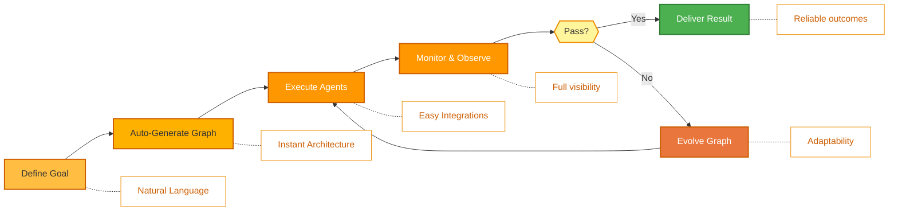
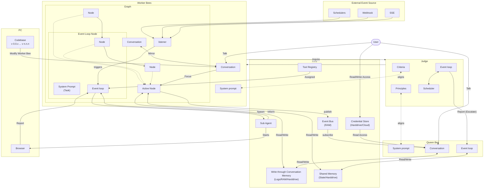

<p align="center">
  
</p>

<p align="center">
  <a href="../../README.md">English</a> |
  <a href="zh-CN.md">简体中文</a> |
  <a href="es.md">Español</a> |
  <a href="hi.md">हिन्दी</a> |
  <a href="pt.md">Português</a> |
  <a href="ja.md">日本語</a> |
  <a href="ru.md">Русский</a> |
  <a href="ko.md">한국어</a>
</p>

<p align="center">
  <a href="https://github.com/aden-hive/hive/blob/main/LICENSE"></a>
  <a href="https://www.ycombinator.com/companies/aden"></a>
  <a href="https://discord.com/invite/MXE49hrKDk"></a>
  <a href="https://x.com/aden_hq"></a>
  <a href="https://www.linkedin.com/company/teamaden/"></a>
  
</p>

<p align="center">
  
  
  
  
  
</p>
<p align="center">
  
  
  
</p>

## 개요

워크플로우를 하드코딩하지 않고도 자율적이고 안정적이며 자체 개선 기능을 갖춘 AI 에이전트를 구축하세요. 코딩 에이전트와의 대화를 통해 목표를 정의하면, 프레임워크가 동적으로 생성된 연결 코드로 구성된 노드 그래프를 자동으로 생성합니다. 문제가 발생하면 프레임워크는 실패 데이터를 수집하고, 코딩 에이전트를 통해 에이전트를 진화시킨 뒤 다시 배포합니다. 사람이 개입할 수 있는(Human-in-the-Loop) 노드, 자격 증명 관리, 실시간 모니터링 기능이 기본으로 제공되어, 적응성을 유지하면서도 제어권을 잃지 않도록 합니다.

자세한 문서, 예제, 가이드는 [adenhq.com](https://adenhq.com)에서 확인할 수 있습니다.

[](https://www.youtube.com/watch?v=XDOG9fOaLjU)

## Hive는 누구를 위한 것인가?

Hive는 복잡한 워크플로를 수동으로 연결하지 않고 **프로덕션 수준의 AI 에이전트**를 구축하고자 하는 개발자와 팀을 위해 설계되었습니다.

다음과 같은 경우 Hive가 적합합니다:

- 데모가 아닌 **실제 비즈니스 프로세스를 실행하는** AI 에이전트를 원하는 경우
- 하드코딩된 워크플로보다 **목표 기반 개발**을 선호하는 경우
- 시간이 지남에 따라 개선되는 **자기 복구 및 적응형 에이전트**가 필요한 경우
- **사람 개입(Human-in-the-Loop) 제어**, 관측성, 비용 제한이 필요한 경우
- **프로덕션 환경**에서 에이전트를 실행할 계획인 경우

단순한 에이전트 체인이나 일회성 스크립트만 실험하는 경우에는 Hive가 최적의 선택이 아닐 수 있습니다.

## 언제 Hive를 사용해야 하나요?

다음이 필요할 때 Hive를 사용하세요:

- 장기 실행 자율 에이전트
- 강력한 가드레일, 프로세스, 제어 장치
- 실패 기반의 지속적 개선
- 멀티 에이전트 협업
- 목표에 맞게 진화하는 프레임워크

## 빠른 링크

- **[문서](https://docs.adenhq.com/)** - 전체 가이드와 API 레퍼런스
- **[셀프 호스팅 가이드](https://docs.adenhq.com/getting-started/quickstart)** - 자체 인프라에 Hive 배포하기
- **[변경 사항(Changelog)](https://github.com/aden-hive/hive/releases)** - 최신 업데이트 및 릴리스 내역
- **[로드맵](../roadmap.md)** - 향후 기능 및 계획
- **[이슈 신고](https://github.com/adenhq/hive/issues)** - 버그 리포트 및 기능 요청
- **[기여하기](../../CONTRIBUTING.md)** - 기여 방법 및 PR 제출 가이드

## 빠른 시작

### 사전 요구 사항

- 에이전트 개발을 위한 Python 3.11+
- 에이전트 스킬 활용을 위한 Claude Code, Codex CLI, 또는 Cursor

> **Windows 사용자 참고:** 이 프레임워크를 실행하려면 **WSL (Windows Subsystem for Linux)** 또는 **Git Bash** 사용을 강력히 권장합니다. 일부 핵심 자동화 스크립트는 표준 명령 프롬프트나 PowerShell에서 올바르게 실행되지 않을 수 있습니다.

### 설치

> **참고**
> Hive는 `uv` 워크스페이스 레이아웃을 사용하며 `pip install`로 설치하지 않습니다.
> 저장소 루트에서 `pip install -e .`를 실행하면 플레이스홀더 패키지만 생성되며 Hive가 올바르게 작동하지 않습니다.
> 아래의 quickstart 스크립트를 사용하여 환경을 설정해 주세요.

```bash
# 저장소 클론
git clone https://github.com/aden-hive/hive.git
cd hive


# quickstart 설정 실행
./quickstart.sh
```

다음 요소들이 설치됩니다:

- **framework** - 핵심 에이전트 런타임 및 그래프 실행기 (`core/.venv` 내)
- **aden_tools** - 에이전트 기능을 위한 MCP 도구 (`tools/.venv` 내)
- **credential store** - 암호화된 API 키 저장소 (`~/.hive/credentials`)
- **LLM provider** - 대화형 기본 모델 설정
- `uv`를 통한 모든 필수 Python 의존성

- 마지막으로, 브라우저에서 Hive 인터페이스가 열립니다


### 첫 번째 에이전트 만들기

홈 화면의 입력 상자에 구축하려는 에이전트를 입력하세요


### 템플릿 에이전트 사용하기

"Try a sample agent"를 클릭하고 템플릿을 확인하세요. 템플릿을 바로 실행하거나, 기존 템플릿을 기반으로 자신만의 버전을 구축할 수 있습니다.

## 주요 기능

- **Browser-Use** - 컴퓨터의 브라우저를 제어하여 어려운 작업을 수행
- **병렬 실행** - 생성된 그래프를 병렬로 실행. 여러 에이전트가 동시에 작업을 완료할 수 있습니다
- **[목표 기반 생성](../key_concepts/goals_outcome.md)** - 자연어로 목표를 정의하면, 코딩 에이전트가 이를 달성하기 위한 에이전트 그래프와 연결 코드를 생성
- **[적응성](../key_concepts/evolution.md)** - 프레임워크가 실패를 수집하고, 목표에 맞게 보정하며, 에이전트 그래프를 진화
- **[동적 노드 연결](../key_concepts/graph.md)** - 사전 정의된 엣지 없이, 목표에 따라 LLM이 연결 코드를 생성
- **SDK 래핑 노드** - 모든 노드는 기본적으로 공유 메모리, 로컬 RLM 메모리, 모니터링, 도구, LLM 접근 권한 제공
- **[사람 개입형(Human-in-the-Loop)](../key_concepts/graph.md#human-in-the-loop)** - 실행을 일시 중지하고 사람의 입력을 받는 개입 노드 제공 (타임아웃 및 에스컬레이션 설정 가능)
- **실시간 관측성** - WebSocket 스트리밍을 통해 에이전트 실행, 의사결정, 노드 간 통신을 실시간으로 모니터링
- **프로덕션 대응** - 셀프 호스팅 가능하며, 확장성과 안정성을 고려해 설계됨

## 통합

<a href="https://github.com/aden-hive/hive/tree/main/tools/src/aden_tools/tools"></a>
Hive는 모델에 구애받지 않고 시스템에 구애받지 않도록 설계되었습니다.

- **LLM 유연성** - Hive Framework는 LiteLLM 호환 제공자를 통해 호스팅 및 로컬 모델을 포함한 다양한 유형의 LLM을 지원하도록 설계되었습니다.
- **비즈니스 시스템 연결** - Hive Framework는 MCP를 통해 CRM, 지원, 메시징, 데이터, 파일, 내부 API 등 모든 종류의 비즈니스 시스템을 도구로 연결하도록 설계되었습니다.

## 왜 Aden인가

Hive는 범용 에이전트가 아닌, 실제 비즈니스 프로세스를 실행하는 에이전트를 생성하는 데 초점을 맞춥니다. 워크플로를 수동으로 설계하고, 에이전트 간 상호작용을 정의하며, 실패를 사후적으로 처리하도록 요구하는 대신, Hive는 패러다임을 뒤집습니다: **결과를 설명하면, 시스템이 스스로를 구축합니다** -- 사용하기 쉬운 도구와 통합 세트로 결과 중심의 적응형 경험을 제공합니다.



### Hive의 강점

| 기존 프레임워크 | Hive |
| --- | --- |
| 에이전트 워크플로 하드코딩 | 자연어로 목표를 설명 |
| 수동 그래프 정의 | 에이전트 그래프 자동 생성 |
| 사후 대응식 에러 처리 | 결과 평가 및 적응성 |
| 정적인 도구 설정 | 동적인 SDK 래핑 노드 |
| 별도의 모니터링 구성 | 내장된 실시간 관측성 |
| 수동 예산 관리 | 비용 제어 및 모델 다운그레이드 통합 |

### 작동 방식

1. **[목표 정의](../key_concepts/goals_outcome.md)** → 달성하고 싶은 결과를 자연어로 설명
2. **코딩 에이전트 생성** → [에이전트 그래프](../key_concepts/graph.md), 연결 코드, 테스트 케이스를 생성
3. **[워커 실행](../key_concepts/worker_agent.md)** → SDK로 래핑된 노드가 완전한 관측성과 도구 접근 권한을 갖고 실행
4. **컨트롤 플레인 모니터링** → 실시간 메트릭, 예산 집행, 정책 관리
5. **[적응성](../key_concepts/evolution.md)** → 실패 시 시스템이 그래프를 진화시키고 자동으로 재배포

## 에이전트 실행

에이전트를 선택하여(기존 에이전트 또는 예제 에이전트) 실행할 수 있습니다. 좌측 상단의 Run 버튼을 클릭하거나, Queen 에이전트와 대화하면 에이전트를 대신 실행해 줍니다.

## 문서

- **[개발자 가이드](../developer-guide.md)** - 개발자를 위한 종합 가이드
- [시작하기](../getting-started.md) - 빠른 설정 방법
- [설정 가이드](../configuration.md) - 모든 설정 옵션 안내
- [아키텍처 개요](../architecture/README.md) - 시스템 설계 및 구조

## 로드맵

Aden Hive Agent Framework는 개발자가 결과 중심(outcome-oriented)이며 자기 적응형(self-adaptive) 에이전트를 구축할 수 있도록 돕는 것을 목표로 합니다. 자세한 내용은 [roadmap.md](../roadmap.md)를 참조하세요.



## 기여하기
커뮤니티의 기여를 환영합니다! 특히 프레임워크를 위한 도구, 통합, 예제 에이전트 구축에 도움을 주실 분을 찾고 있습니다 ([#2805 확인](https://github.com/aden-hive/hive/issues/2805)). 기능 확장에 관심이 있으시다면 여기가 시작하기에 최적의 장소입니다. 가이드라인은 [CONTRIBUTING.md](../../CONTRIBUTING.md)를 참고해 주세요.

**중요:** PR을 제출하기 전에 먼저 이슈에 할당받으세요. 이슈에 댓글을 달아 담당을 요청하면 유지관리자가 할당해 드립니다. 재현 가능한 단계와 제안이 포함된 이슈가 우선 처리됩니다. 이는 중복 작업을 방지하는 데 도움이 됩니다.

1. 이슈를 찾거나 생성하고 할당받습니다
2. 저장소를 포크합니다
3. 기능 브랜치를 생성합니다 (`git checkout -b feature/amazing-feature`)
4. 변경 사항을 커밋합니다 (`git commit -m 'Add amazing feature'`)
5. 브랜치에 푸시합니다 (`git push origin feature/amazing-feature`)
6. Pull Request를 생성합니다

## 커뮤니티 및 지원

지원, 기능 요청, 커뮤니티 토론을 위해 [Discord](https://discord.com/invite/MXE49hrKDk)를 사용합니다.

- Discord - [커뮤니티 참여하기](https://discord.com/invite/MXE49hrKDk)
- Twitter/X - [@adenhq](https://x.com/aden_hq)
- LinkedIn - [회사 페이지](https://www.linkedin.com/company/teamaden/)

## 팀에 합류하세요

**채용 중입니다!** 엔지니어링, 연구, 그리고 Go-To-Market 분야에서 함께하실 분을 찾고 있습니다.

[채용 공고 보기](https://jobs.adenhq.com/a8cec478-cdbc-473c-bbd4-f4b7027ec193/applicant)

## 보안

보안 관련 문의 사항은 [SECURITY.md](../../SECURITY.md)를 참고해 주세요.

## 라이선스

본 프로젝트는 Apache License 2.0 하에 배포됩니다. 자세한 내용은 [LICENSE](../../LICENSE) 파일을 참고해 주세요.

## 자주 묻는 질문 (FAQ)

**Q: Hive는 어떤 LLM 제공자를 지원하나요?**

Hive는 LiteLLM 연동을 통해 100개 이상의 LLM 제공자를 지원합니다. 여기에는 OpenAI(GPT-4, GPT-4o), Anthropic(Claude 모델), Google Gemini, DeepSeek, Mistral, Groq 등이 포함됩니다. 적절한 API 키 환경 변수를 설정하고 모델 이름만 지정하면 바로 사용할 수 있습니다. Claude, GLM, Gemini를 사용하는 것이 가장 좋은 성능을 제공하므로 권장합니다.

**Q: Ollama 같은 로컬 AI 모델과 함께 Hive를 사용할 수 있나요?**

네, 가능합니다! Hive는 LiteLLM을 통해 로컬 모델을 지원합니다. `ollama/model-name` 형식(예: `ollama/llama3`, `ollama/mistral`)으로 모델 이름을 지정하고, Ollama가 로컬에서 실행 중이면 됩니다.

**Q: Hive가 다른 에이전트 프레임워크와 다른 점은 무엇인가요?**

Hive는 코딩 에이전트를 사용하여 자연어 목표로부터 전체 에이전트 시스템을 생성합니다. 워크플로를 하드코딩하거나 그래프를 수동으로 정의할 필요가 없습니다. 에이전트가 실패하면 프레임워크가 실패 데이터를 자동으로 수집하고, [에이전트 그래프를 진화시킨](../key_concepts/evolution.md) 뒤 다시 배포합니다. 이러한 자기 개선 루프는 Aden만의 고유한 특징입니다.

**Q: Hive는 오픈소스인가요?**

네. Hive는 Apache License 2.0 하에 배포되는 완전한 오픈소스 프로젝트입니다. 커뮤니티의 기여와 협업을 적극적으로 장려하고 있습니다.

**Q: Hive는 복잡한 프로덕션 규모의 사용 사례도 처리할 수 있나요?**

네. Hive는 자동 실패 복구, 실시간 관측성, 비용 제어, 수평 확장 지원 등 프로덕션 환경을 명확히 목표로 설계되었습니다. 단순한 자동화부터 복잡한 멀티 에이전트 워크플로까지 모두 처리할 수 있습니다.

**Q: Hive는 Human-in-the-Loop 워크플로를 지원하나요?**

네. Hive는 사람의 입력을 받기 위해 실행을 일시 중지하는 [개입 노드](../key_concepts/graph.md#human-in-the-loop)를 통해 Human-in-the-Loop 워크플로를 완전히 지원합니다. 타임아웃과 에스컬레이션 정책을 설정할 수 있어, 인간 전문가와 AI 에이전트 간의 원활한 협업이 가능합니다.

**Q: Hive는 어떤 프로그래밍 언어를 지원하나요?**

Hive 프레임워크는 Python으로 구축되었습니다. JavaScript/TypeScript SDK는 로드맵에 포함되어 있습니다.

**Q: Hive 에이전트는 외부 도구나 API와 연동할 수 있나요?**

네. Aden의 SDK로 래핑된 노드는 기본적인 도구 접근 기능을 제공하며, 유연한 도구 생태계를 지원합니다. 노드 아키텍처를 통해 외부 API, 데이터베이스, 다양한 서비스와 연동할 수 있습니다.

**Q: Hive에서 비용 제어는 어떻게 이루어지나요?**

Hive는 지출 한도, 호출 제한, 자동 모델 다운그레이드 정책 등 세밀한 예산 제어 기능을 제공합니다. 팀, 에이전트, 워크플로 단위로 예산을 설정할 수 있으며, 실시간 비용 추적과 알림 기능을 제공합니다.

**Q: 예제와 문서는 어디에서 확인할 수 있나요?**

전체 가이드, API 레퍼런스, 시작 튜토리얼은 [docs.adenhq.com](https://docs.adenhq.com/)에서 확인하실 수 있습니다. 저장소의 `docs/` 디렉터리와 종합적인 [개발자 가이드](../developer-guide.md)도 함께 제공됩니다.

**Q: Aden에 기여하려면 어떻게 해야 하나요?**

기여를 환영합니다! 저장소를 포크하고 기능 브랜치를 생성한 뒤 변경 사항을 구현하여 Pull Request를 제출해 주세요. 자세한 내용은 [CONTRIBUTING.md](../../CONTRIBUTING.md)를 참고해 주세요.

---

<p align="center">
  Made with 🔥 Passion in San Francisco
</p>
