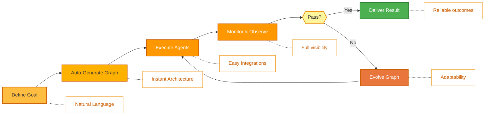
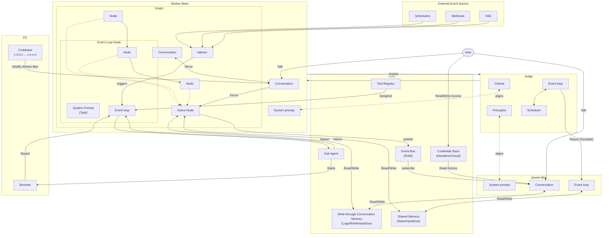

<p align="center">
  
</p>

<p align="center">
  <a href="../../README.md">English</a> |
  <a href="zh-CN.md">简体中文</a> |
  <a href="es.md">Español</a> |
  <a href="hi.md">हिन्दी</a> |
  <a href="pt.md">Português</a> |
  <a href="ja.md">日本語</a> |
  <a href="ru.md">Русский</a> |
  <a href="ko.md">한국어</a>
</p>

<p align="center">
  <a href="https://github.com/aden-hive/hive/blob/main/LICENSE"></a>
  <a href="https://www.ycombinator.com/companies/aden"></a>
  <a href="https://discord.com/invite/MXE49hrKDk"></a>
  <a href="https://x.com/aden_hq"></a>
  <a href="https://www.linkedin.com/company/teamaden/"></a>
  
</p>

<p align="center">
  
  
  
  
  
</p>
<p align="center">
  
  
  
</p>

## Visão Geral

Construa agentes de IA autônomos, confiáveis e auto-aperfeiçoáveis sem codificar fluxos de trabalho. Defina seu objetivo através de uma conversa com um agente de codificação, e o framework gera um grafo de nós com código de conexão criado dinamicamente. Quando algo quebra, o framework captura dados de falha, evolui o agente através do agente de codificação e reimplanta. Nós de intervenção humana integrados, gerenciamento de credenciais e monitoramento em tempo real dão a você controle sem sacrificar a adaptabilidade.

Visite [adenhq.com](https://adenhq.com) para documentação completa, exemplos e guias.

[](https://www.youtube.com/watch?v=XDOG9fOaLjU)

## Para Quem é o Hive?

O Hive é projetado para desenvolvedores e equipes que desejam construir **agentes de IA de nível de produção** sem conectar manualmente fluxos de trabalho complexos.

O Hive é ideal se você:

- Deseja agentes de IA que **executem processos de negócios reais**, não demos
- Prefere **desenvolvimento orientado a objetivos** em vez de fluxos de trabalho codificados
- Precisa de **agentes auto-adaptáveis e auto-reparáveis** que melhoram ao longo do tempo
- Requer **controle com humano no loop**, observabilidade e limites de custo
- Planeja executar agentes em **ambientes de produção**

O Hive pode não ser a melhor escolha se você está apenas experimentando cadeias de agentes simples ou scripts únicos.

## Quando Você Deve Usar o Hive?

Use o Hive quando precisar de:

- Agentes autônomos de longa duração
- Guardrails robustos, processos e controles
- Melhoria contínua baseada em falhas
- Coordenação multi-agente
- Um framework que evolui com seus objetivos

## Links Rápidos

- **[Documentação](https://docs.adenhq.com/)** - Guias completos e referência de API
- **[Guia de Auto-Hospedagem](https://docs.adenhq.com/getting-started/quickstart)** - Implante o Hive em sua infraestrutura
- **[Changelog](https://github.com/aden-hive/hive/releases)** - Últimas atualizações e versões
- **[Roadmap](../roadmap.md)** - Funcionalidades e planos futuros
- **[Reportar Problemas](https://github.com/adenhq/hive/issues)** - Relatórios de bugs e solicitações de funcionalidades
- **[Contribuindo](../../CONTRIBUTING.md)** - Como contribuir e enviar PRs

## Início Rápido

### Pré-requisitos

- Python 3.11+ para desenvolvimento de agentes
- Claude Code, Codex CLI ou Cursor para utilizar habilidades de agentes

> **Nota para Usuários Windows:** É fortemente recomendado usar **WSL (Windows Subsystem for Linux)** ou **Git Bash** para executar este framework. Alguns scripts de automação principais podem não funcionar corretamente no Prompt de Comando ou PowerShell padrão.

### Instalação

> **Nota**
> O Hive usa um layout de workspace `uv` e não é instalado com `pip install`.
> Executar `pip install -e .` a partir da raiz do repositório criará um pacote placeholder e o Hive não funcionará corretamente.
> Por favor, use o script de quickstart abaixo para configurar o ambiente.

```bash
# Clone the repository
git clone https://github.com/aden-hive/hive.git
cd hive


# Run quickstart setup
./quickstart.sh
```

Isto configura:

- **framework** - Runtime principal do agente e executor de grafos (em `core/.venv`)
- **aden_tools** - Ferramentas MCP para capacidades de agentes (em `tools/.venv`)
- **credential store** - Armazenamento criptografado de chaves API (`~/.hive/credentials`)
- **LLM provider** - Configuração interativa de modelo padrão
- Todas as dependências Python necessárias com `uv`

- Por fim, ele iniciará a interface open hive no seu navegador


### Construa Seu Primeiro Agente

Digite o agente que deseja construir na caixa de entrada da tela inicial


### Use Agentes de Template

Clique em "Try a sample agent" e confira os templates. Você pode executar um template diretamente ou escolher construir sua versão em cima do template existente.

## Funcionalidades

- **Browser-Use** - Controle o navegador no seu computador para realizar tarefas difíceis
- **Execução Paralela** - Execute o grafo gerado em paralelo. Desta forma, você pode ter múltiplos agentes completando as tarefas por você
- **[Geração Orientada a Objetivos](../key_concepts/goals_outcome.md)** - Defina objetivos em linguagem natural; o agente de codificação gera o grafo de agentes e código de conexão para alcançá-los
- **[Adaptabilidade](../key_concepts/evolution.md)** - Framework captura falhas, calibra de acordo com os objetivos e evolui o grafo de agentes
- **[Conexões de Nós Dinâmicas](../key_concepts/graph.md)** - Sem arestas predefinidas; código de conexão é gerado por qualquer LLM capaz baseado em seus objetivos
- **Nós Envolvidos em SDK** - Cada nó recebe memória compartilhada, memória RLM local, monitoramento, ferramentas e acesso LLM prontos para uso
- **[Humano no Loop](../key_concepts/graph.md#human-in-the-loop)** - Nós de intervenção que pausam a execução para entrada humana com timeouts configuráveis e escalonamento
- **Observabilidade em Tempo Real** - Streaming WebSocket para monitoramento ao vivo de execução de agentes, decisões e comunicação entre nós
- **Pronto para Produção** - Auto-hospedável, construído para escala e confiabilidade

## Integração

<a href="https://github.com/aden-hive/hive/tree/main/tools/src/aden_tools/tools"></a>
O Hive é construído para ser agnóstico em relação a modelos e sistemas.

- **Flexibilidade de LLM** - O Hive Framework é projetado para suportar vários tipos de LLMs, incluindo modelos hospedados e locais através de provedores compatíveis com LiteLLM.
- **Conectividade com sistemas empresariais** - O Hive Framework é projetado para conectar-se a todos os tipos de sistemas empresariais como ferramentas, como CRM, suporte, mensagens, dados, arquivos e APIs internas via MCP.

## Por que Aden

O Hive foca em gerar agentes que executam processos de negócios reais em vez de agentes genéricos. Em vez de exigir que você projete manualmente fluxos de trabalho, defina interações de agentes e lide com falhas reativamente, o Hive inverte o paradigma: **você descreve resultados, e o sistema se constrói sozinho** — entregando uma experiência adaptativa e orientada a resultados com um conjunto fácil de usar de ferramentas e integrações.



### A Vantagem Hive

| Frameworks Tradicionais                 | Hive                                       |
| --------------------------------------- | ------------------------------------------ |
| Codificar fluxos de trabalho de agentes | Descrever objetivos em linguagem natural   |
| Definição manual de grafos              | Grafos de agentes auto-gerados             |
| Tratamento reativo de erros             | Avaliação de resultados e adaptabilidade   |
| Configurações de ferramentas estáticas  | Nós dinâmicos envolvidos em SDK            |
| Configuração de monitoramento separada  | Observabilidade em tempo real integrada    |
| Gerenciamento de orçamento DIY          | Controles de custo e degradação integrados |

### Como Funciona

1. **[Defina Seu Objetivo](../key_concepts/goals_outcome.md)** → Descreva o que você quer alcançar em linguagem simples
2. **Agente de Codificação Gera** → Cria o [grafo de agentes](../key_concepts/graph.md), código de conexão e casos de teste
3. **[Workers Executam](../key_concepts/worker_agent.md)** → Nós envolvidos em SDK executam com observabilidade completa e acesso a ferramentas
4. **Plano de Controle Monitora** → Métricas em tempo real, aplicação de orçamento, gerenciamento de políticas
5. **[Adaptabilidade](../key_concepts/evolution.md)** → Em caso de falha, o sistema evolui o grafo e reimplanta automaticamente

## Executar Agentes

Agora você pode executar um agente selecionando o agente (seja um agente existente ou um agente de exemplo). Você pode clicar no botão Executar no canto superior esquerdo, ou conversar com o agente queen e ele pode executar o agente para você.

## Documentação

- **[Guia do Desenvolvedor](../developer-guide.md)** - Guia abrangente para desenvolvedores
- [Começando](../getting-started.md) - Instruções de configuração rápida
- [Guia de Configuração](../configuration.md) - Todas as opções de configuração
- [Visão Geral da Arquitetura](../architecture/README.md) - Design e estrutura do sistema

## Roadmap

O Aden Hive Agent Framework visa ajudar desenvolvedores a construir agentes auto-adaptativos orientados a resultados. Veja [roadmap.md](../roadmap.md) para detalhes.



## Contribuindo
Aceitamos contribuições da comunidade! Estamos especialmente procurando ajuda para construir ferramentas, integrações e agentes de exemplo para o framework ([confira #2805](https://github.com/aden-hive/hive/issues/2805)). Se você está interessado em estender a funcionalidade, este é o lugar perfeito para começar. Por favor, consulte [CONTRIBUTING.md](../../CONTRIBUTING.md) para diretrizes.

**Importante:** Por favor, seja atribuído a uma issue antes de enviar um PR. Comente na issue para reivindicá-la e um mantenedor irá atribuí-la a você. Issues com passos reproduzíveis e propostas são priorizadas. Isso ajuda a evitar trabalho duplicado.

1. Encontre ou crie uma issue e seja atribuído
2. Faça fork do repositório
3. Crie sua branch de funcionalidade (`git checkout -b feature/amazing-feature`)
4. Faça commit das suas alterações (`git commit -m 'Add amazing feature'`)
5. Faça push para a branch (`git push origin feature/amazing-feature`)
6. Abra um Pull Request

## Comunidade e Suporte

Usamos [Discord](https://discord.com/invite/MXE49hrKDk) para suporte, solicitações de funcionalidades e discussões da comunidade.

- Discord - [Junte-se à nossa comunidade](https://discord.com/invite/MXE49hrKDk)
- Twitter/X - [@adenhq](https://x.com/aden_hq)
- LinkedIn - [Página da Empresa](https://www.linkedin.com/company/teamaden/)

## Junte-se ao Nosso Time

**Estamos contratando!** Junte-se a nós em funções de engenharia, pesquisa e go-to-market.

[Ver Posições Abertas](https://jobs.adenhq.com/a8cec478-cdbc-473c-bbd4-f4b7027ec193/applicant)

## Segurança

Para questões de segurança, por favor consulte [SECURITY.md](../../SECURITY.md).

## Licença

Este projeto está licenciado sob a Licença Apache 2.0 - veja o arquivo [LICENSE](../../LICENSE) para detalhes.

## Perguntas Frequentes (FAQ)

**P: Quais provedores de LLM o Hive suporta?**

O Hive suporta mais de 100 provedores de LLM através da integração LiteLLM, incluindo OpenAI (GPT-4, GPT-4o), Anthropic (modelos Claude), Google Gemini, DeepSeek, Mistral, Groq e muitos mais. Simplesmente configure a variável de ambiente da chave API apropriada e especifique o nome do modelo. Recomendamos usar Claude, GLM e Gemini, pois possuem o melhor desempenho.

**P: Posso usar o Hive com modelos de IA locais como Ollama?**

Sim! O Hive suporta modelos locais através do LiteLLM. Simplesmente use o formato de nome de modelo `ollama/model-name` (ex.: `ollama/llama3`, `ollama/mistral`) e certifique-se de que o Ollama esteja rodando localmente.

**P: O que torna o Hive diferente de outros frameworks de agentes?**

O Hive gera todo o seu sistema de agentes a partir de objetivos em linguagem natural usando um agente de codificação — você não codifica fluxos de trabalho nem define grafos manualmente. Quando os agentes falham, o framework captura automaticamente os dados de falha, [evolui o grafo de agentes](../key_concepts/evolution.md) e reimplanta. Este loop de auto-aperfeiçoamento é único do Aden.

**P: O Hive é open-source?**

Sim, o Hive é totalmente open-source sob a Licença Apache 2.0. Incentivamos ativamente contribuições e colaboração da comunidade.

**P: O Hive pode lidar com casos de uso complexos em escala de produção?**

Sim. O Hive é explicitamente projetado para ambientes de produção com funcionalidades como recuperação automática de falhas, observabilidade em tempo real, controles de custo e suporte a escalabilidade horizontal. O framework lida tanto com automações simples quanto com fluxos de trabalho multi-agente complexos.

**P: O Hive suporta fluxos de trabalho com humano no loop?**

Sim, o Hive suporta totalmente fluxos de trabalho com [humano no loop](../key_concepts/graph.md#human-in-the-loop) através de nós de intervenção que pausam a execução para entrada humana. Estes incluem timeouts configuráveis e políticas de escalonamento, permitindo colaboração perfeita entre especialistas humanos e agentes de IA.

**P: Quais linguagens de programação o Hive suporta?**

O framework Hive é construído em Python. Um SDK JavaScript/TypeScript está no roadmap.

**P: Os agentes do Hive podem interagir com ferramentas e APIs externas?**

Sim. Os nós envolvidos em SDK do Aden fornecem acesso integrado a ferramentas, e o framework suporta ecossistemas flexíveis de ferramentas. Os agentes podem integrar-se com APIs externas, bancos de dados e serviços através da arquitetura de nós.

**P: Como funciona o controle de custos no Hive?**

O Hive fornece controles de orçamento granulares incluindo limites de gastos, throttles e políticas de degradação automática de modelo. Você pode definir orçamentos no nível de equipe, agente ou fluxo de trabalho, com rastreamento de custos e alertas em tempo real.

**P: Onde posso encontrar exemplos e documentação?**

Visite [docs.adenhq.com](https://docs.adenhq.com/) para guias completos, referência de API e tutoriais de introdução. O repositório também inclui documentação na pasta `docs/` e um abrangente [guia do desenvolvedor](../developer-guide.md).

**P: Como posso contribuir para o Aden?**

Contribuições são bem-vindas! Faça fork do repositório, crie sua branch de funcionalidade, implemente suas alterações e envie um pull request. Consulte [CONTRIBUTING.md](../../CONTRIBUTING.md) para diretrizes detalhadas.

---

<p align="center">
  Feito com 🔥 Paixão em San Francisco
</p>
