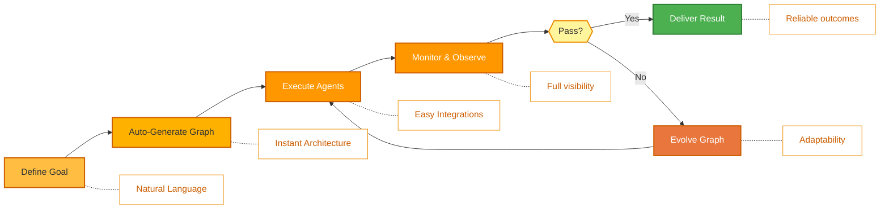
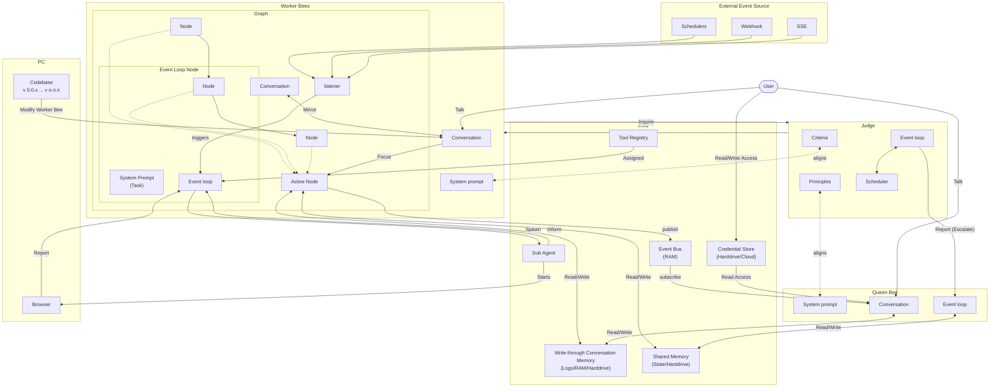

<p align="center">
  
</p>

<p align="center">
  <a href="../../README.md">English</a> |
  <a href="zh-CN.md">简体中文</a> |
  <a href="es.md">Español</a> |
  <a href="hi.md">हिन्दी</a> |
  <a href="pt.md">Português</a> |
  <a href="ja.md">日本語</a> |
  <a href="ru.md">Русский</a> |
  <a href="ko.md">한국어</a>
</p>

<p align="center">
  <a href="https://github.com/aden-hive/hive/blob/main/LICENSE"></a>
  <a href="https://www.ycombinator.com/companies/aden"></a>
  <a href="https://discord.com/invite/MXE49hrKDk"></a>
  <a href="https://x.com/aden_hq"></a>
  <a href="https://www.linkedin.com/company/teamaden/"></a>
  
</p>

<p align="center">
  
  
  
  
  
</p>
<p align="center">
  
  
  
</p>

## Обзор

Создавайте автономных, надёжных, самосовершенствующихся ИИ-агентов без жёсткого кодирования рабочих процессов. Определите свою цель через разговор с кодирующим агентом, и фреймворк сгенерирует граф узлов с динамически созданным кодом соединений. Когда что-то ломается, фреймворк захватывает данные об ошибке, эволюционирует агента через кодирующего агента и переразвёртывает. Встроенные узлы человеческого вмешательства, управление учётными данными и мониторинг в реальном времени дают вам контроль без ущерба для адаптивности.

Посетите [adenhq.com](https://adenhq.com) для полной документации, примеров и руководств.

[](https://www.youtube.com/watch?v=XDOG9fOaLjU)

## Для кого создан Hive?

Hive создан для разработчиков и команд, которые хотят строить **ИИ-агентов производственного уровня** без ручной настройки сложных рабочих процессов.

Hive подойдёт вам, если вы:

- Хотите ИИ-агентов, которые **выполняют реальные бизнес-процессы**, а не демо
- Предпочитаете **целеориентированную разработку** вместо жёстко закодированных рабочих процессов
- Нуждаетесь в **самовосстанавливающихся и адаптивных агентах**, которые улучшаются со временем
- Требуете **контроль с человеком в контуре**, наблюдаемость и лимиты затрат
- Планируете запускать агентов в **продакшен-среде**

Hive может не подойти, если вы только экспериментируете с простыми цепочками агентов или одноразовыми скриптами.

## Когда следует использовать Hive?

Используйте Hive, когда вам нужны:

- Долгосрочные автономные агенты
- Надёжные защитные барьеры, процессы и контроль
- Непрерывное улучшение на основе сбоев
- Координация нескольких агентов
- Фреймворк, который эволюционирует вместе с вашими целями

## Быстрые ссылки

- **[Документация](https://docs.adenhq.com/)** - Полные руководства и справочник API
- **[Руководство по самостоятельному хостингу](https://docs.adenhq.com/getting-started/quickstart)** - Разверните Hive в своей инфраструктуре
- **[История изменений](https://github.com/aden-hive/hive/releases)** - Последние обновления и релизы
- **[Дорожная карта](../roadmap.md)** - Предстоящие функции и планы
- **[Сообщить о проблеме](https://github.com/adenhq/hive/issues)** - Отчёты об ошибках и запросы функций
- **[Участие в разработке](../../CONTRIBUTING.md)** - Как внести вклад и отправить PR

## Быстрый старт

### Предварительные требования

- Python 3.11+ для разработки агентов
- Claude Code, Codex CLI или Cursor для использования навыков агентов

> **Примечание для пользователей Windows:** Настоятельно рекомендуется использовать **WSL (Подсистему Windows для Linux)** или **Git Bash** для запуска этого фреймворка. Некоторые основные скрипты автоматизации могут работать некорректно в стандартной командной строке или PowerShell.

### Установка

> **Примечание**
> Hive использует структуру рабочего пространства `uv` и не устанавливается через `pip install`.
> Выполнение `pip install -e .` из корня репозитория создаст пакет-заглушку и Hive не будет работать корректно.
> Пожалуйста, используйте скрипт быстрого старта ниже для настройки окружения.

```bash
# Клонировать репозиторий
git clone https://github.com/aden-hive/hive.git
cd hive


# Запустить настройку быстрого старта
./quickstart.sh
```

Это установит:

- **framework** - Основная среда выполнения агентов и исполнитель графов (в `core/.venv`)
- **aden_tools** - MCP-инструменты для возможностей агентов (в `tools/.venv`)
- **credential store** - Зашифрованное хранилище API-ключей (`~/.hive/credentials`)
- **LLM provider** - Интерактивная настройка модели по умолчанию
- Все необходимые зависимости Python через `uv`

- В конце будет запущен интерфейс open hive в вашем браузере


### Создайте своего первого агента

Введите описание агента, которого хотите создать, в поле ввода на главном экране


### Используйте шаблоны агентов

Нажмите «Try a sample agent» и просмотрите шаблоны. Вы можете запустить шаблон напрямую или создать свою версию на основе существующего шаблона.

## Функции

- **Browser-Use** - Управление браузером на вашем компьютере для выполнения сложных задач
- **Параллельное выполнение** - Выполнение сгенерированного графа параллельно. Таким образом, несколько агентов могут выполнять задачи за вас
- **[Целеориентированная генерация](../key_concepts/goals_outcome.md)** - Определяйте цели на естественном языке; кодирующий агент генерирует граф агентов и код соединений для их достижения
- **[Адаптивность](../key_concepts/evolution.md)** - Фреймворк захватывает сбои, калибруется в соответствии с целями и эволюционирует граф агентов
- **[Динамические соединения узлов](../key_concepts/graph.md)** - Без предопределённых рёбер; код соединений генерируется любым способным LLM на основе ваших целей
- **Узлы, обёрнутые SDK** - Каждый узел получает общую память, локальную RLM-память, мониторинг, инструменты и доступ к LLM из коробки
- **[Человек в контуре](../key_concepts/graph.md#human-in-the-loop)** - Узлы вмешательства, которые приостанавливают выполнение для человеческого ввода с настраиваемыми таймаутами и эскалацией
- **Наблюдаемость в реальном времени** - WebSocket-стриминг для живого мониторинга выполнения агентов, решений и межузловой коммуникации
- **Готовность к продакшену** - Возможность самостоятельного хостинга, создан для масштабирования и надёжности

## Интеграция

<a href="https://github.com/aden-hive/hive/tree/main/tools/src/aden_tools/tools"></a>
Hive создан модельно-агностичным и системно-агностичным.

- **Гибкость LLM** - Hive Framework разработан для поддержки различных типов LLM, включая облачные и локальные модели через LiteLLM-совместимых провайдеров.
- **Подключение к бизнес-системам** - Hive Framework разработан для подключения ко всем видам бизнес-систем в качестве инструментов, таким как CRM, поддержка, мессенджеры, данные, файлы и внутренние API через MCP.

## Почему Aden

Hive фокусируется на генерации агентов, которые выполняют реальные бизнес-процессы, а не на создании универсальных агентов. Вместо того чтобы требовать от вас ручного проектирования рабочих процессов, определения взаимодействий агентов и реактивной обработки сбоев, Hive переворачивает парадигму: **вы описываете результаты, и система строит себя сама** — обеспечивая ориентированный на результат, адаптивный опыт с удобным набором инструментов и интеграций.



### Преимущество Hive

| Традиционные фреймворки               | Hive                                         |
| ------------------------------------- | -------------------------------------------- |
| Жёсткое кодирование рабочих процессов | Описание целей на естественном языке         |
| Ручное определение графов             | Автоматически генерируемые графы агентов     |
| Реактивная обработка ошибок           | Оценка результатов и адаптивность            |
| Статические конфигурации инструментов | Динамические узлы, обёрнутые SDK             |
| Отдельная настройка мониторинга       | Встроенная наблюдаемость в реальном времени  |
| DIY управление бюджетом               | Интегрированный контроль затрат и деградация |

### Как это работает

1. **[Определите цель](../key_concepts/goals_outcome.md)** → Опишите, чего хотите достичь, простым языком
2. **Кодирующий агент генерирует** → Создаёт [граф агентов](../key_concepts/graph.md), код соединений и тестовые случаи
3. **[Рабочие выполняют](../key_concepts/worker_agent.md)** → Узлы, обёрнутые SDK, работают с полной наблюдаемостью и доступом к инструментам
4. **Плоскость управления мониторит** → Метрики в реальном времени, применение бюджета, управление политиками
5. **[Адаптивность](../key_concepts/evolution.md)** → При сбое система эволюционирует граф и автоматически переразвёртывает

## Запуск агентов

Теперь вы можете запустить агента, выбрав его (существующего агента или пример агента). Вы можете нажать кнопку «Run» в верхнем левом углу или поговорить с агентом-маткой, и он запустит агента за вас.

## Документация

- **[Руководство разработчика](../developer-guide.md)** - Полное руководство для разработчиков
- [Начало работы](../getting-started.md) - Инструкции по быстрой настройке
- [Руководство по конфигурации](../configuration.md) - Все опции конфигурации
- [Обзор архитектуры](../architecture/README.md) - Дизайн и структура системы

## Дорожная карта

Aden Hive Agent Framework призван помочь разработчикам создавать самоадаптирующихся агентов, ориентированных на результат. Подробности см. в [roadmap.md](../roadmap.md).



## Участие в разработке
Мы приветствуем вклад сообщества! Мы особенно ищем помощь в создании инструментов, интеграций и примеров агентов для фреймворка ([см. #2805](https://github.com/aden-hive/hive/issues/2805)). Если вы заинтересованы в расширении его функциональности, это идеальное место для начала. Пожалуйста, ознакомьтесь с [CONTRIBUTING.md](../../CONTRIBUTING.md) для руководств.

**Важно:** Пожалуйста, получите назначение на issue перед отправкой PR. Оставьте комментарий в issue, чтобы заявить о своём желании работать над ним, и мейнтейнер назначит вас. Issues с воспроизводимыми шагами и предложениями приоритизируются. Это помогает избежать дублирования работы.

1. Найдите или создайте issue и получите назначение
2. Сделайте форк репозитория
3. Создайте ветку функции (`git checkout -b feature/amazing-feature`)
4. Зафиксируйте изменения (`git commit -m 'Add amazing feature'`)
5. Отправьте в ветку (`git push origin feature/amazing-feature`)
6. Откройте Pull Request

## Сообщество и поддержка

Мы используем [Discord](https://discord.com/invite/MXE49hrKDk) для поддержки, запросов функций и обсуждений сообщества.

- Discord - [Присоединиться к сообществу](https://discord.com/invite/MXE49hrKDk)
- Twitter/X - [@adenhq](https://x.com/aden_hq)
- LinkedIn - [Страница компании](https://www.linkedin.com/company/teamaden/)

## Присоединяйтесь к команде

**Мы нанимаем!** Присоединяйтесь к нам на позициях в инженерии, исследованиях и выходе на рынок.

[Посмотреть открытые позиции](https://jobs.adenhq.com/a8cec478-cdbc-473c-bbd4-f4b7027ec193/applicant)

## Безопасность

По вопросам безопасности, пожалуйста, обратитесь к [SECURITY.md](../../SECURITY.md).

## Лицензия

Этот проект лицензирован под лицензией Apache 2.0 — см. файл [LICENSE](../../LICENSE) для деталей.

## Часто задаваемые вопросы (FAQ)

**В: Каких провайдеров LLM поддерживает Hive?**

Hive поддерживает более 100 провайдеров LLM через интеграцию LiteLLM, включая OpenAI (GPT-4, GPT-4o), Anthropic (модели Claude), Google Gemini, DeepSeek, Mistral, Groq и многих других. Просто настройте соответствующую переменную окружения API-ключа и укажите имя модели. Мы рекомендуем использовать Claude, GLM и Gemini, так как они показывают лучшую производительность.

**В: Могу ли я использовать Hive с локальными ИИ-моделями, такими как Ollama?**

Да! Hive поддерживает локальные модели через LiteLLM. Просто используйте формат имени модели `ollama/model-name` (например, `ollama/llama3`, `ollama/mistral`) и убедитесь, что Ollama запущен локально.

**В: Что делает Hive отличным от других фреймворков агентов?**

Hive генерирует всю систему агентов из целей на естественном языке, используя кодирующего агента — вы не кодируете рабочие процессы и не определяете графы вручную. Когда агенты терпят неудачу, фреймворк автоматически захватывает данные о сбое, [эволюционирует граф агентов](../key_concepts/evolution.md) и переразвёртывает. Этот цикл самосовершенствования уникален для Aden.

**В: Является ли Hive проектом с открытым исходным кодом?**

Да, Hive полностью с открытым исходным кодом под лицензией Apache 2.0. Мы активно поощряем вклад и сотрудничество сообщества.

**В: Может ли Hive справляться со сложными сценариями продакшен-масштаба?**

Да. Hive специально разработан для продакшен-среды с такими функциями, как автоматическое восстановление после сбоев, наблюдаемость в реальном времени, контроль затрат и поддержка горизонтального масштабирования. Фреймворк справляется как с простыми автоматизациями, так и со сложными многоагентными рабочими процессами.

**В: Поддерживает ли Hive рабочие процессы с человеком в контуре?**

Да, Hive полностью поддерживает рабочие процессы с [человеком в контуре](../key_concepts/graph.md#human-in-the-loop) через узлы вмешательства, которые приостанавливают выполнение для человеческого ввода. Они включают настраиваемые таймауты и политики эскалации, обеспечивая бесшовное сотрудничество между экспертами-людьми и ИИ-агентами.

**В: Какие языки программирования поддерживает Hive?**

Фреймворк Hive написан на Python. JavaScript/TypeScript SDK находится в дорожной карте.

**В: Могут ли агенты Hive взаимодействовать с внешними инструментами и API?**

Да. Узлы, обёрнутые SDK от Aden, предоставляют встроенный доступ к инструментам, и фреймворк поддерживает гибкие экосистемы инструментов. Агенты могут интегрироваться с внешними API, базами данных и сервисами через архитектуру узлов.

**В: Как работает контроль затрат в Hive?**

Hive предоставляет детальный контроль бюджета, включая лимиты расходов, ограничения и политики автоматической деградации модели. Вы можете устанавливать бюджеты на уровне команды, агента или рабочего процесса с отслеживанием затрат в реальном времени и оповещениями.

**В: Где найти примеры и документацию?**

Посетите [docs.adenhq.com](https://docs.adenhq.com/) для полных руководств, справочника API и обучающих материалов по началу работы. Репозиторий также включает документацию в папке `docs/` и подробное [руководство разработчика](../developer-guide.md).

**В: Как я могу внести вклад в Aden?**

Вклад приветствуется! Сделайте форк репозитория, создайте ветку функции, реализуйте изменения и отправьте pull request. Подробные руководства см. в [CONTRIBUTING.md](../../CONTRIBUTING.md).

---

<p align="center">
  Made with 🔥 Passion in San Francisco
</p>
